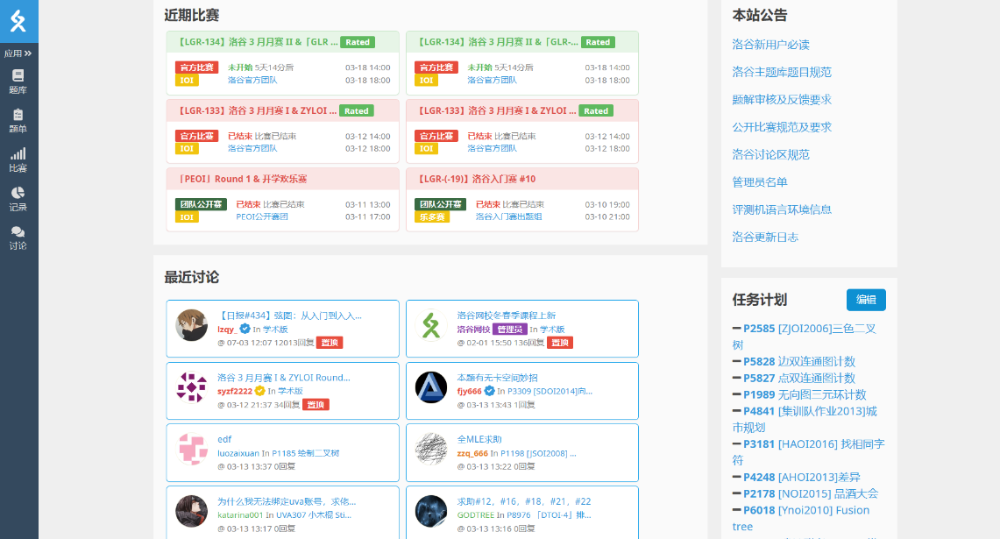
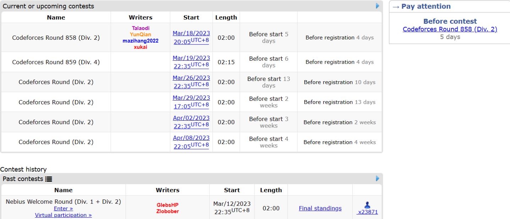
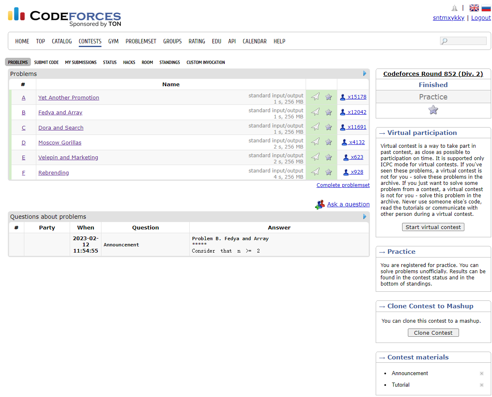
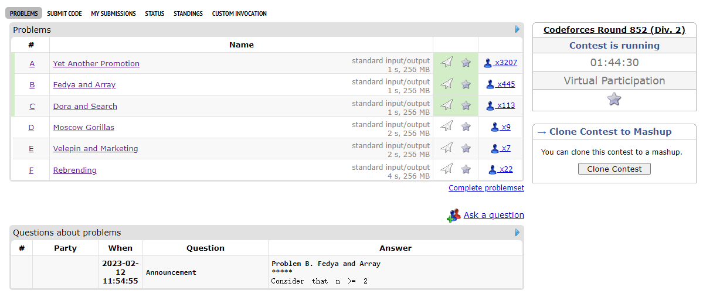
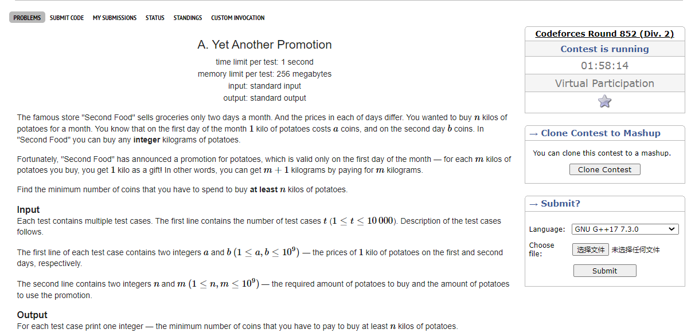
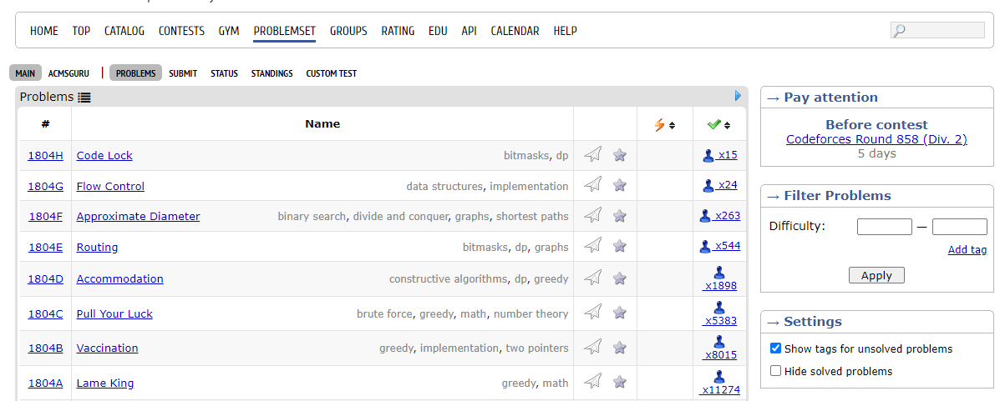

# 3.2.2 手把手教你学算法——如何使用 OJ（Online Judge）

在之前的篇章中，我们向新手 acmer 推荐了两个编程网站——Luogu 与 Codeforces，下面由笔者向各位介绍一下网站的详细用法。

# Luogu

进入 [https://www.luogu.com.cn/](https://www.luogu.com.cn/)

## 社交模块

做为一个刷题网站，Luogu 提供了符合中文用户习惯的社交模块。体现于左侧边栏的讨论及主页的最近讨论，以及底部的“发射犇犇”系统。但是我并不建议 Acmer 使用该功能，因为 Luogu 主要面向初高中生甚至小学生等参加 NOIP 系列竞赛的用户，讨论不可避免存在一些低龄化现象。对于社交模块的使用，我推荐当且仅当一种做不出题的求助手段，这点放在之后题目模块讲解。

## 题目模块

点开题库，我们看见以下界面

在上方我们可以筛选我们想要的题目，接下来我们点开 P1000 为例

右侧三个模块为折叠状态，下面介绍他们的作用

① 标签：假如你已经对算法有了基本的了解，面对一道题毫无思路，那么你可以试试看正解所使用的算法，寻找思路的突破口

② 讨论：假如你的代码因未知原因一直出错，你可以试试讨论（越难的题有效信息越多）看看自己是否犯下别人犯过的错误或者可以发帖求助（关于如何正确发帖求助，请参考《提问的艺术》）

③ 推荐题目：没做爽？再来一道类似的（请勿沉迷刷水题，过题量除了炫耀毫无意义）

右上方点击查看题解，查看其他用户撰写的参考答案和讲解。

点击提交答案

左侧可以选择语言类型，C++ 用户建议选择 C++14。

O2 优化是一种优化（废话）假如您的代码复杂度正确但 TLE，可以尝试该选项。

## 记录模块

怎么知道自己代码的问题出在哪里呢？记录模块是帮助你的好工具。

AC：通过该数据点

WA：答案错误 常见原因：没开 Long Long 导致数据溢出、少取模、格式错误、忘记删除调试代码

RE：运行错误 常见原因：数组访问越界、访问空指针、除零模零、主函数返回非 0，评测机炸了（极小概率）

UKE：未知错误 常见于 Remote Judge，建议重交或者去原网站交

TLE：运行超时 请检查算法复杂度与是否存在死循环，也可尝试使用 O2 优化。搜索“卡常数”了解更多缩短运行时间小寄巧

MLE：空间超限 请检查是否递归爆栈、数组过大

OLE：输出超限 放心你见不到的

## 题单模块

点开侧栏题单

建议新手从官方精选题单开始，由浅入深，由简到难。等到对算法形成概念，针对漏洞补习时可以尝试用户分享题单（到那个阶段已经有很多手段去找题了，刘教练的题单就够你做了）

## 比赛模块

点开侧栏就能看见准备举办和已结束的比赛。笔者不建议大家在 Luogu 打比赛，首先赛制不一样，其次出题风格不一样，最后对于初学者 Luogu 比赛的难度曲线过大。

# Codeforces

进入 [https://codeforces.com/?locale=en](https://codeforces.com/?locale=en)

比起 Luogu，这样的 UI 设计离 CN 互联网已经很远了（然而比起更硬核的一些做题网站，CF 的 UI 真是越看越顺眼）

右上角注册登录切语言（哇塞，可以选俄语，你说的对，但是 CF 是一款由俄罗斯开发的多人在线竞技游戏）

## HOME 模块

主页显示各种数据，主要为近期比赛的一些公告。

## TOP 模块

热帖，如果擅长英语的话，CF 的交流氛围还是不错的，做为一个答疑解惑的论坛肯定比国内强。

## CATALOG 模块

文档目录，你可以在这学习算法竞赛入门，体系化学习算法，只要你会英语

## CONTESTS

重中之重！CF 的比赛系统可以说是我们选择这个网站的最大原因！

进入比赛页面

上方为将举办比赛，显示开始时间（UTC+8 也就是我们时区的时间）和持续时间大多都开始的比较晚，例如笔者就没有这么晚学习的习惯，所以一般赛后写题。比赛分为以下几种类型（例如写在括号里的 Div.2）

Div.1、Div.2、Div.3、Div.4 数字越小难度越大。

建议新手从 Div.2 及以下的难度打起，在比赛时间内写的题目很少也不要气馁，CF 出题审题质量稳定，写到就是赚到，赛后补题就行

对于已经结束的比赛，我们可以直接点击“Enter”进入比赛看题补题，也可以点击“Virtual partipation”简称“VP”，重现赛时场景，例如显示赛时排行榜，即时过题人数等，在比赛完成后你也可以看见如果你以该状态参赛，你会获得怎样的排名。

下面以一场 Div.2 比赛为例，展示我们该如何打一场 CF。

## VP

这是一场笔者之前赛后补过的 Div.2，画面右下角分别为赛后公告和题解，右侧便是开启 VP 的按钮。

<em>VP</em><em>模拟赛时的好处就是在虚拟参赛中获得真实比赛才能积累的经验，比如这里笔者发现通过前三题后，我应该先去看看 F 题，因为做出来的人更多，我有更大的可能性做出来，ACM 中题目并不是 100% 按难度排序。</em>

进入 VP 后，我们可以发现比起正常赛后补题有了明显不同。

首先我们可以看见赛时某道题的通过人数，随比赛时间流逝 100% 仿真变化。而且也可以与当时的“虚拟选手”同步竞争，例如笔者这里就复制之前写过的代码荣登榜三（乐）

对于大多数比赛，采用 ICPC 赛制，解决某题得到的分数由该题当前的分数减去(不成功的提交次数)*50，这里某道题的分数是由比赛开始时的分数随时间线性减少得到的。

也就是做题越快，错误次数越少，分数和排名就越高，这点大体是与 ACM 赛制相同的。

当然，CF 还有极具特色的 Hack 玩法，这些深入内容留给有上分兴趣的读者研究。

让我们点开 A 题，来看看如何提交答案

可以看见，右侧有一个 submit，与 luogu 不同的是，你需要上传源代码文件（如 cpp）然后选择 G++17 为语言，提交。

当然，你也可以点开上侧的 submit code

选择题目、语言，填写代码后提交，就和 Luogu 的方式一样了。

同样，在上侧 MY SUBMISSIONS 处可以查看已提交的代码和状态

## PROBLEMSET

同样，CF 也有题库

如果你只想做某道题而不是某场比赛，这里也许更适合你。

不过 CF 的题库比较鸡肋，标签筛选也不是很方便（大概是把想要的标签在右上角分隔好）

# 总结

笔者向读者详细介绍了两个 OJ，至于如何让 OJ 更好的辅助你的 ACM 学习，我应该在什么时间节点或训练阶段，出于什么训练目的选择哪个网站，笔者留到下一个篇章继续介绍。
