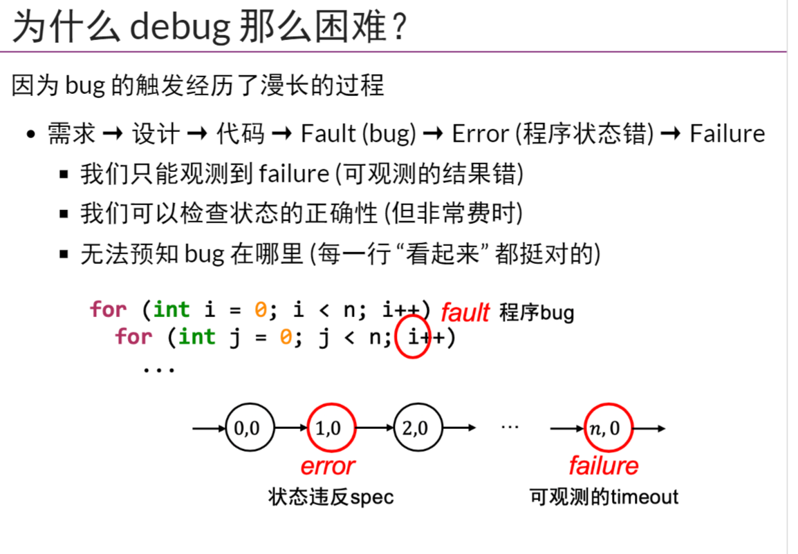

# 调试理论

# 调试公理

- The machine is always right. (机器永远是对的)

  - Corollary: If the program does not produce the desired output, it is the programmer's fault.
- Every line of untested code is always wrong. (未测试代码永远是错的)

  - Corollary: Mistakes are likely to appear in the "must-be-correct" code.

这两条公理的意思是: 抱怨是没有用的, 接受代码有 bug 的现实, 耐心调试.

# 如何调试

- 不要使用"目光调试法", 要思考如何用正确的工具和方法帮助调试

  - 程序设计课上盯着几十行的程序, 你或许还能在大脑中像 NEMU 那样模拟程序的执行过程; 但程序规模大了之后, 很快你就会放弃的: 你的大脑不可能模拟得了一个巨大的状态机
  - 我们学习计算机是为了学习计算机的工作原理, 而不是学习如何像计算机那样机械地工作
- 使用 `assert()` 设置检查点, 拦截非预期情况

  - 例如 `assert(p != NULL)` 就可以拦截由空指针解引用引起的段错误
- 结合对程序执行行为的理解, 使用 `printf()` 查看程序执行的情况(注意字符串要换行)

  - `printf()` 输出任意信息可以检查代码可达性: 输出了相应信息, 当且仅当相应的代码块被执行
  - `printf()` 输出变量的值, 可以检查其变化过程与原因
- 使用 GDB 观察程序的任意状态和行为

  - 打印变量, 断点, 监视点, 函数调用栈...

# 调试理论

如果我们能判定任意程序状态的正确性，那么给定一个 failure，我们可以通过二分查找定位到第一个 error 的状态，此时的代码就是 fault (bug)。

# 正确的方法：理解程序的执行过程，弄清楚到底为何导致了 bug

- `ssh`：使用 `-v` 选项检查日志
- `gcc`：使用 `-v` 选项打印各种过程
- `make`：使用 `-n` 选项查看完整命令

  - `make -nB | grep -ve '^\(echo\|mkdir\)'` 可以查看完整编译 nemu 的编译过程

各个工具普遍提供调试功能，帮助用户/开发者了解程序的行为

# 错误概念

我们来简单梳理一下段错误发生的原因. 首先, 机器永远是对的. 如果程序出了错, 先怀疑自己的代码有 bug . 比如由于你的疏忽, 你编写了 `if (p = NULL)` 这样的代码. 但执行到这行代码的时候, 也只是 `p` 被赋值成 `NULL`, 程序还会往下执行. 然而等到将来对 `p` 进行了解引用的时候, 才会触发段错误, 程序彻底崩溃.

我们可以从上面的这个例子中抽象出一些软件工程相关的概念:

- Fault: 实现错误的代码, 例如 `if (p = NULL)`
- Error: 程序执行时不符合预期的状态, 例如 `p` 被错误地赋值成 `NULL`
- Failure: 能直接观测到的错误, 例如程序触发了段错误

调试其实就是从观测到的 failure 一步一步回溯寻找 fault 的过程, 找到了 fault 之后, 我们就很快知道应该如何修改错误的代码了. 但从上面的例子也可以看出, 调试之所以不容易, 恰恰是因为:

- fault 不一定马上触发 error
- 触发了 error 也不一定马上转变成可观测的 failure
- error 会像滚雪球一般越积越多, 当我们观测到 failure 的时候, 其实已经距离 fault 非常遥远了

理解了这些原因之后, 我们就可以制定相应的策略了:

- 尽可能把 fault 转变成 error. 这其实就是测试做的事情, 所以我们在上一节中加入了表达式生成器的内容, 来帮助大家进行测试, 后面的实验内容也会提供丰富的测试用例. 但并不是有了测试用例就能把所有 fault 都转变成 error 了, 因为这取决于测试的覆盖度. 要设计出一套全覆盖的测试并不是一件简单的事情, 越是复杂的系统, 全覆盖的测试就越难设计. 但是, 如何提高测试的覆盖度, 是学术界一直以来都在关注的问题.
