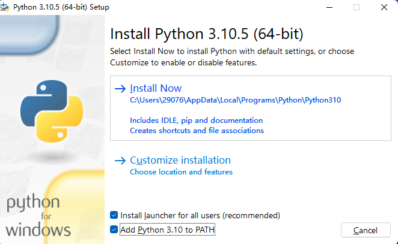
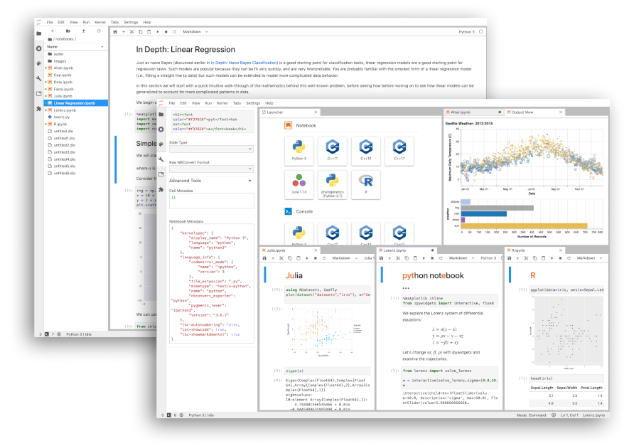

# 安装 python

教程

[Python 小白必看，非常生动的 Pycharm 与 Anaconda 安装教学，干货！_哔哩哔哩_bilibili](https://www.bilibili.com/video/BV1Bp4y117UW?p=1&share_medium=android&share_plat=android&share_source=COPY&share_tag=s_i&timestamp=1623240637&unique_k=vHC5Wg)

[Win10 下 Conda-Pycharm-Pytorch 的安装_哔哩哔哩_bilibili](https://www.bilibili.com/video/BV15U4y1J7Ss?from=search&seid=1987861827719523712&spm_id_from=333.337.0.0)

# 巧妇难为无米之炊

你可以在终端上用 Python 解释器

也可以尝试使用 VSC，Pycharm 等集成开发环境

同样我们也推荐你使用 Jupyter Notebook

我们推荐你都进行一波尝试，同样这也会作为一个任务

# 解释器

# Windows 用户

打开 [Python 官方网站](https://www.python.org/)，找到“Download”里的“Latest: Python 3.x.y”。

<strong>下载完成后，请大家按照下图的示意，务必勾选“Add Python 3.x to PATH”，然后再点击“Install Now”，等待安装完成后关闭安装程序。</strong>

<strong>注意：windows11 安装好后 命令行输入 python 可能会跳到 Microsoft 应用商店 可在 customize installation（自定义安装）next  勾选 install for all users</strong>

## GNU/Linux 系统

在终端输入 `sudo apt install python3` 即可完成 Python3 的全部安装流程

可以输入 `python3 --version` 检验是否成功。

# Jupyter Notebook

[官方网站](https://jupyter.org/) Jupyter Notebook 是基于网页的用于交互计算的应用程序。其可被应用于全过程计算：开发、文档编写、运行代码和展示结果。——[Jupyter ](https://link.zhihu.com/?target=https%3A//jupyter-notebook.readthedocs.io/en/stable/notebook.html)

你在一个框框中直接输入代码，运行，它立马就在下面给你输出。怎么样，是不是很酷？

[Notebook 官方介绍](https://link.zhihu.com/?target=https%3A//jupyter-notebook.readthedocs.io/en/stable/notebook.html)

可能需要你安装 anaconda，如果你不知道这是什么，请去阅读这篇文章并进行相关配置 [Anaconda](https://zhuanlan.zhihu.com/p/32925500)（STFW）

安装完 jupyer 后，可以在终端直接输入

jupyter notebook

进行使用

[Pycharm](https://www.jetbrains.com/zh-cn/pycharm/)：可能很多同学已经用上了，我在这里不做更多解释
