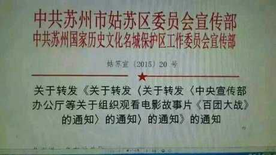

# 阶段二：递归操作

什么是递归呢？



# 

# 释义

递归是在函数主体中重复调用函数的基本方案

让我们来看一个经典的例子

> 阶乘，即 n！=n*(n-1)*......*2*1<br/>例如： `5! = 5 * 4 * 3 * 2 * 1 = 120`.

而阶乘的代码如下编辑

```python
def factorial(n):
    if n == 0:
        return 1
    return n * factorial(n - 1)
```

编写递归函数的一些小 tips：

- 你必须假设之前的所有功能都是正确的，这种被称为：the recursive leap of faith
- 想想在最简单的情况下函数将如何跳转
- 考虑使用问题的更简单版本来进行解决问题

# 任务

P4：编写一个递归函数 `skip_add`，它接受一个参数 n 并返回 `n + n-2 + n-4 + n-6 + ... + 0`。假设 n 是非负数。

```python
def skip_add(n):
    """ Takes a number n and returns n + n-2 + n-4 + n-6 + ... + 0.

    >>> skip_add(5)  # 5 + 3 + 1 + 0
    9
    >>> skip_add(10) # 10 + 8 + 6 + 4 + 2 + 0
    30
    
    """
    "*** YOUR CODE HERE ***"
```

P5：GCD，给出两个正整数，求出两个正整数的最大公约数

Euclid, a Greek mathematician in 300 B.C., realized that the greatest common divisor of `a` and `b` is one of the following:

- the smaller value if it evenly divides the larger value, or
- the greatest common divisor of the smaller value and the remainder of the larger value divided by the smaller value.

提示：gcd(a, b) = gcd(b, a % b)

```python
def gcd(a, b):
    """Returns the greatest common divisor of a and b.
    Should be implemented using recursion.

    >>> gcd(34, 19)
    1
    >>> gcd(39, 91)
    13
    >>> gcd(20, 30)
    10
    >>> gcd(40, 40)
    40
    """
    "*** YOUR CODE HERE ***"7
```

P6：汉诺塔问题（选做）

汉诺塔：汉诺塔（又称河内塔）问题是源于印度一个古老传说的益智玩具。大梵天创造世界的时候做了三根金刚石柱子，在一根柱子上从下往上按照大小顺序摞着 64 片黄金圆盘。大梵天命令婆罗门把圆盘从下面开始按大小顺序重新摆放在另一根柱子上。并且规定，在小圆盘上不能放大圆盘，在三根柱子之间一次只能移动一个圆盘。

汉诺塔有递归和非递归两种方法，你最好选择递归的方法进行书写

```python
def print_move(origin, destination):
    """Print instructions to move a disk."""
    print("Move the top disk from rod", origin, "to rod", destination)

def move_stack(n, start, end):
    """Print the moves required to move n disks on the start pole to the end
    pole without violating the rules of Towers of Hanoi.

    n -- number of disks
    start -- a pole position, either 1, 2, or 3
    end -- a pole position, either 1, 2, or 3

    There are exactly three poles, and start and end must be different. Assume
    that the start pole has at least n disks of increasing size, and the end
    pole is either empty or has a top disk larger than the top n start disks.

    >>> move_stack(1, 1, 3)
    Move the top disk from rod 1 to rod 3
    >>> move_stack(2, 1, 3)
    Move the top disk from rod 1 to rod 2
    Move the top disk from rod 1 to rod 3
    Move the top disk from rod 2 to rod 3
    >>> move_stack(3, 1, 3)
    Move the top disk from rod 1 to rod 3
    Move the top disk from rod 1 to rod 2
    Move the top disk from rod 3 to rod 2
    Move the top disk from rod 1 to rod 3
    Move the top disk from rod 2 to rod 1
    Move the top disk from rod 2 to rod 3
    Move the top disk from rod 1 to rod 3
    """
    assert 1 <= start <= 3 and 1 <= end <= 3 and start != end, "Bad start/end"
    "*** YOUR CODE HERE ***"
```

ZZM 在这里恶意提升亿下难度，你能不能尝试理解下面这个用 C 语言写的汉诺塔呢

当然，是非递归！

```c
typedef struct {
  int pc, n;
  char from, to, via;
} Frame;

#define call(...) ({ *(++top) = (Frame) { .pc = 0, __VA_ARGS__ }; })
#define ret()     ({ top--; })
#define goto(loc) ({ f->pc = (loc) - 1; })

void hanoi(int n, char from, char to, char via) {
  Frame stk[64], *top = stk - 1;
  call(n, from, to, via);
  for (Frame *f; (f = top) >= stk; f->pc++) {
    switch (f->pc) {
      case 0: if (f->n == 1) { printf("%c -> %c\n", f->from, f->to); goto(4); } break;
      case 1: call(f->n - 1, f->from, f->via, f->to);   break;
      case 2: call(       1, f->from, f->to,  f->via);  break;
      case 3: call(f->n - 1, f->via,  f->to,  f->from); break;
      case 4: ret();                                    break;
      default: assert(0);
    }
  }
}
```
