# 机器学习（AI）快速入门（quick start）

本章内容需要你掌握一定的 python 基础知识。

如果你想要快速了解机器学习，并且动手尝试去实践他，你可以先阅览本部分内容。

里面包含 python 内容的一点点基本语法包括 if,for 等语句，函数等概念即可，你可以遇到了再去学。

就算没有编程基础也基本能看懂，选择着跳过吧

当然我需要承认一点，为了让大家都可以看懂，我做了很多抽象，具有了很多例子，某些内容不太准确，这是必然的，最为准确的往往是课本上精确到少一个字都不行的概念，这是难以理解的。

本篇内容只适合新手理解使用，所以不免会损失一些精度。

# 什么是机器学习

这个概念其实不需要那么多杂七杂八的概念去解释。

首先你要认识到他是人工智能的一部分，不需要写任何与问题有关的特定代码。你把数据输入相关的算法里面，他给你总结相应的规律。

我举个例子，你现在把他当成一个黑盒，不需要知道里面有什么，但是你知道他会回答你的问题。你想知道房价会怎么变动来决定现在买不买房。然后你给了他十年的房价数据，他发现每年都在涨，所以给你预测了一个数值。

然后你给了他更多信息，比如说国家给出了某些条例，他分析这个条例一出，房价就会降低，他给你了个新的数据。

因此我们得出一个结论:机器学习 ＝ 泛型算法。

甚至深度学习，也只是机器学习的一部分，不过使用了更多技巧和方法，增大了计算能力罢了。

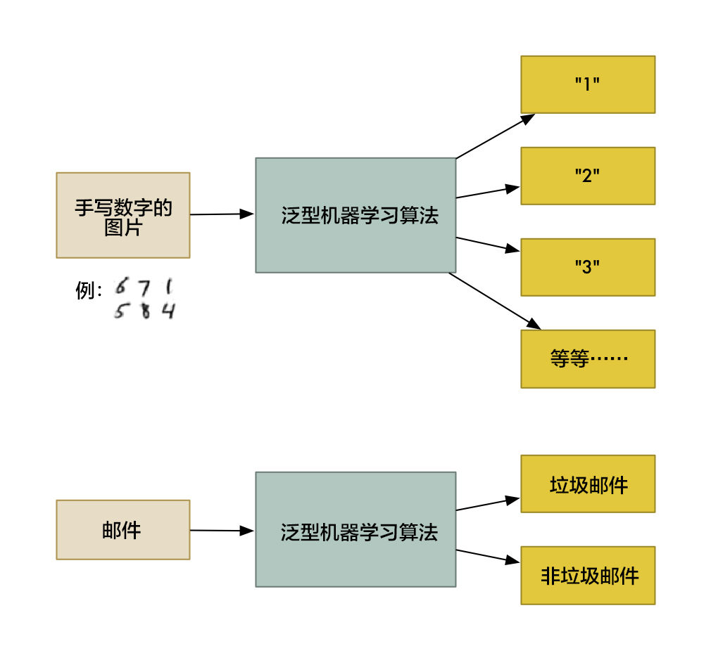

# 两种机器学习算法

你可以把机器学习算法分为两大类：监督式学习（supervised Learning）和非监督式学习（unsupervised Learning）。要区分两者很简单，但也非常重要。

## 监督式学习

你是卖方的，你公司很大，因此你雇了一批新员工来帮忙。

但是问题来了——虽然你可以一眼估算出房子的价格，但新员工却不像你这样经验丰富，他们不知道如何给房子估价。

为了帮助你的新员工，你决定写一个可以根据房屋大小、地段以及同类房屋成交价等因素来评估一间房屋的价格的小软件。

近三个月来，每当你的城市里有人卖了房子，你都记录了下面的细节——卧室数量、房屋大小、地段等等。但最重要的是，你写下了最终的成交价：

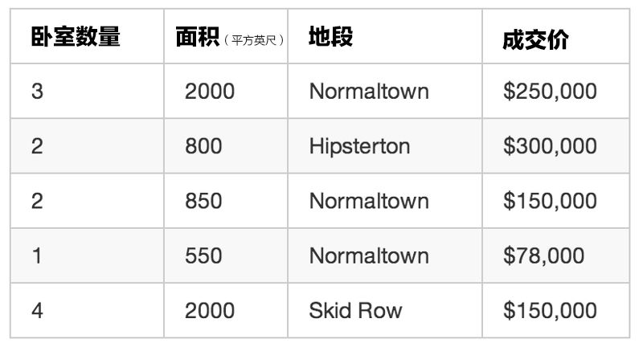

然后你让新人根据着你的成交价来估计新的数量


这就是监督学习，你有一个参照物可以帮你决策。

## 无监督学习

没有答案怎么办？

你可以把类似的分出来啊！

我举个例子，比如说警察叔叔要查晚上的现金流，看看有没有谁干了不好的事情，于是把数据拎出来。

发现晚上十点到十二点间，多数的现金交易是几十块几百块。有十几个是交易几千块的。

然后再把交易给私人账户的和公司账户的分开，发现只有一个是给个人账户的，发现他还是在酒店交易的！

这下糟糕了，警察叔叔去那个酒店一查，果然发现了有人在干不好的事情。

这其实就是一种经典的聚类算法


可以把特征不一样的数据分开，有非常多的操作，你感兴趣可以选择性的去了解一下。

## 太酷炫了，但这也叫 AI？这也叫学习？

作为人类的一员，你的大脑可以应付绝大多数情况，并且在没有任何明确指令时也能够学习如何处理这些情况。而目前的机器学习就是在帮助我们机器建立起解决问题的能力。

但是目前的机器学习算法还没有那么强大——它们只能在非常特定的、有限的问题上有效。也许在这种情况下，「学习」更贴切的定义是「在少量样本数据的基础上找出一个公式来解决特定的问题」。

但是「机器在少量样本数据的基础上找出一个公式来解决特定的问题」不是个好名字。所以最后我们用「机器学习」取而代之。而深度学习，则是机器在数据的基础上通过很深的网络（很多的公式）找一个及解决方案来解决问题。

# 看看 Code

如果你完全不懂机器学习知识，你可能会用一堆 if else 条件判断语句来判断比如说房价

```python
def estimate_house_sales_price(num_of_bedrooms, sqft, neighborhood):
  price = 0<em>  # In my area, the average house costs $200 per sqft</em>
  price_per_sqft = 200  if neighborhood == "hipsterton":
   <em> # but some areas cost a bit more</em>
    price_per_sqft = 400  elif neighborhood == "skid row":
   <em> # and some areas cost less</em>
    price_per_sqft = 100  <em># start with a base price estimate based on how big the place is</em>
  price = price_per_sqft * sqft  <em># now adjust our estimate based on the number of bedrooms</em>
  if num_of_bedrooms == 0:
    <em># Studio apartments are cheap</em>
    price = price — 20000
  else:
   <em> # places with more bedrooms are usually</em>
<em>    # more valuable</em>
    price = price + (num_of_bedrooms * 1000) return price
```

假如你像这样瞎忙几个小时，最后也许会得到一些像模像样的东西。但是永远感觉差点东西。

并且，你维护起来非常吃力，你只能不断地加 if else。

现在看起来还好，但是如果有一万行 if else 呢？

所以你最好考虑换一种方法：如果能让计算机找出实现上述函数功能的办法，岂不更好？只要返回的房价数字正确，谁会在乎函数具体干了些什么呢？

```python
def estimate_house_sales_price(num_of_bedrooms, sqft, neighborhood):
  price = <电脑电脑快显灵>  return price
```

如果你可以找到这么一个公式：

Y(房价)=W(参数）*X1（卧室数量）+W*X2（面积）+W*X3（地段）

你是不是会舒服很多，可以把他想象成，你要做菜，然后那些参数就是佐料的配比

有一种笨办法去求每一个参数的值：

第一步：将所有参数都设置为 1

```python
def estimate_house_sales_price(num_of_bedrooms, sqft, neighborhood):
  price = 0  # a little pinch of this
  price += num_of_bedrooms *<strong> 1.0</strong>  # and a big pinch of that
  price += sqft * <strong>1.0</strong>  # maybe a handful of this
  price += neighborhood * <strong>1.0</strong>  # and finally, just a little extra salt for good measure
  price += <strong>1.0</strong>  return price
```

第二步把每个数值都带入进行运算。

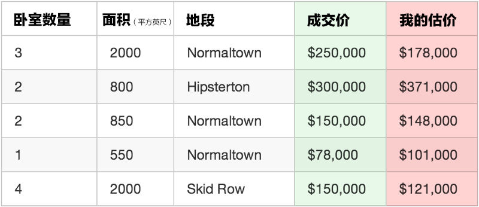

比如说，如果第一套房产实际成交价为 25 万美元，你的函数估价为 17.8 万美元，这一套房产你就差了 7.2 万。

现在，将你的数据集中的每套房产估价偏离值平方后求和。假设你的数据集中交易了 500 套房产，估价偏离值平方求和总计为 86,123,373 美元。这个数字就是你的函数现在的「错误」程度。

现在，将总和除以 500，得到每套房产的估价偏差的平均值。将这个平均误差值称为你函数的代价（cost）。

如果你能通过调整权重，使得这个代价变为 0，你的函数就完美了。它意味着，根据输入的数据，你的程序对每一笔房产交易的估价都是分毫不差。所以这就是我们的目标——通过尝试不同的权重值，使代价尽可能的低。

第三步：

通过尝试所有可能的权重值组合，不断重复第二步。哪一个权重组合的代价最接近于 0，你就使用哪个。当你找到了合适的权重值，你就解决了问题!

兴奋的时刻到了！

挺简单的，对吧？想一想刚才你做了些什么。你拿到了一些数据，将它们输入至三个泛型的、简单的步骤中，最后你得到了一个可以对你所在区域任何房屋进行估价的函数。房价网站们，你们要小心了！

但是下面的一些事实可能会让你更兴奋：

1. 过去 40 年来，很多领域（如语言学、翻译学）的研究表明，这种「搅拌数字汤」（我编的词）的泛型学习算法已经超过了那些真人尝试明确规则的方法。机器学习的「笨」办法终于打败了人类专家。
2. 你最后写出的程序是很笨的，它甚至不知道什么是「面积」和「卧室数量」。它知道的只是搅拌，改变数字来得到正确的答案。
3. 你可能会对「为何一组特殊的权重值会有效」一无所知。你只是写出了一个你实际上并不理解却能证明有效的函数。
4. 试想，如果你的预测函数输入的参数不是「面积」和「卧室数量」，而是一列数字，每个数字代表了你车顶安装的摄像头捕捉的画面中的一个像素。然后，假设预测的输出不是「价格」而是「方向盘转动角度」，这样你就得到了一个程序可以自动操纵你的汽车了！

这可行吗？瞎尝试这不得尝试到海枯石烂？

为了避免这种情况，数学家们找到了很多种[聪明的办法](https://link.zhihu.com/?target=http%3A//en.wikipedia.org/wiki/Gradient_descent)来快速找到优秀的权重值。下面是一种：


这就是被称为 loss 函数的东西。

这是个专业属于，你可以选择性忽略他，我们将它改写一下


<em>θ 表示当前的权重值。 J(θ) 表示「当前权重的代价」。</em>

这个等式表示，在当前权重值下，我们估价程序的偏离程度。

如果我们为这个等式中所有卧室数和面积的可能权重值作图的话，我们会得到类似下图的图表：

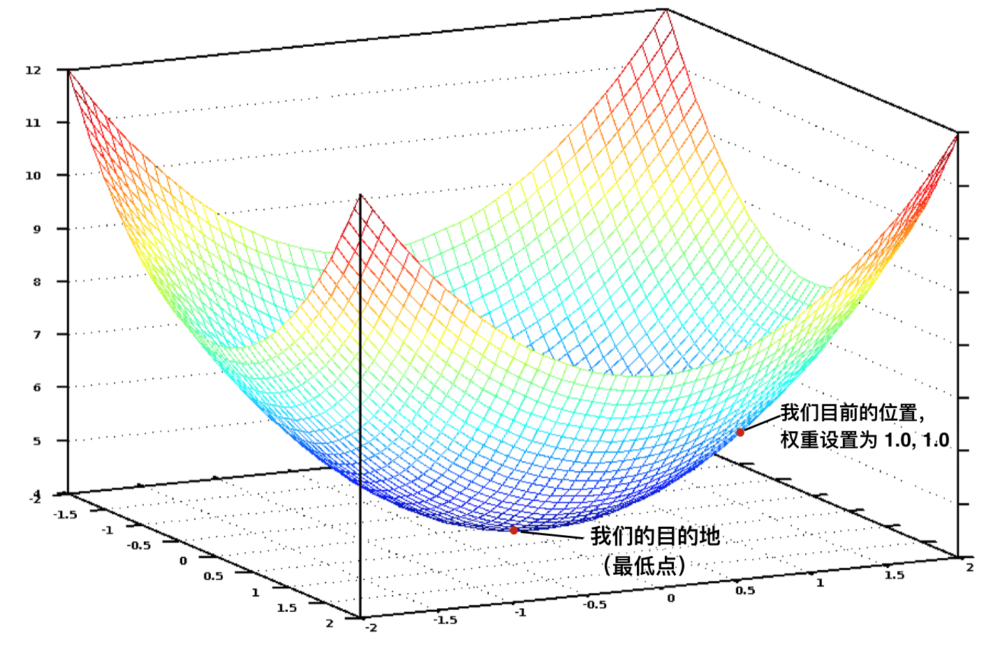

因此，我们需要做的只是调整我们的权重，使得我们在图上朝着最低点「走下坡路」。如果我们不断微调权重，一直向最低点移动，那么我们最终不用尝试太多权重就可以到达那里。

如果你还记得一点微积分的话，你也许记得如果你对一个函数求导，它会告诉你函数任意一点切线的斜率。换句话说，对于图上任意给定的一点，求导能告诉我们哪条是下坡路。我们可以利用这个知识不断走向最低点。

所以，如果我们对代价函数关于每一个权重求偏导，那么我们就可以从每一个权重中减去该值。这样可以让我们更加接近山底。一直这样做，最终我们将到达底部，得到权重的最优值。（读不懂？不用担心，继续往下读）。

这种为函数找出最佳权重的方法叫做批量梯度下降（Batch Gradient Descent）。

当你使用一个机器学习算法库来解决实际问题时，这些都已经为你准备好了。但清楚背后的原理依然是有用的。

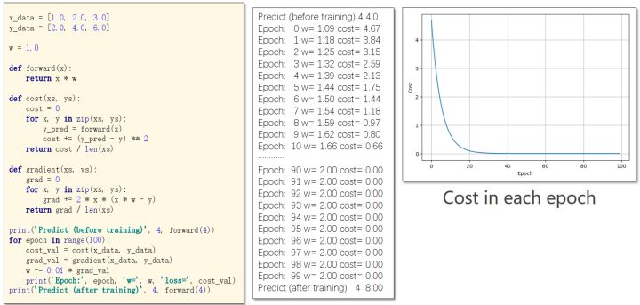

枚举法

上面我描述的三步算法被称为多元线性回归（multivariate linear regression）。你在估算一个能够拟合所有房价数据点的直线表达式。然后，你再根据房子可能在你的直线上出现的位置，利用这个等式来估算你从未见过的房屋的价格。这是一个十分强大的想法，你可以用它来解决「实际」问题。

但是，尽管我展示给你的这种方法可能在简单的情况下有效，它却不能应用于所有情况。原因之一，就是因为房价不会是简简单单一条连续的直线。

不过幸运的是，有很多办法来处理这种情况。有许多机器学习算法可以处理非线性数据。除此之外，灵活使用线性回归也能拟合更复杂的线条。在所有的情况下，寻找最优权重这一基本思路依然适用。

<strong>如果你还是无法理解，你可以将 cost 类比为你出错误的程度，而数学科学家找到各种方法来降低这种程度，当程度降到最低时，我们就可以知道我们要求的数值了</strong>

另外，我忽略了过拟合（overfitting）的概念。得到一组能完美预测原始数据集中房价的权重组很简单，但用这组权重组来预测原始数据集之外的任何新房屋其实都不怎么准确。这也是有许多解决办法的（如[正则化](https://link.zhihu.com/?target=http%3A//en.wikipedia.org/wiki/Regularization_%2528mathematics%2529%23Regularization_in_statistics_and_machine_learning)以及使用[交叉验证](https://link.zhihu.com/?target=http%3A//en.wikipedia.org/wiki/Cross-validation_%2528statistics%2529)的数据集）。学习如何应对这一问题，是学习如何成功应用机器学习技术的重点之一。

换言之，尽管基本概念非常简单，要通过机器学习得到有用的结果还是需要一些技巧和经验的。但是，这是每个开发者都能学会的技巧。

# 更为智能的预测

我们通过上一次的函数假设已经得到了一些值。

```python
def estimate_house_sales_price(num_of_bedrooms, sqft, neighborhood):
 price = 0# a little pinch of this
 price += num_of_bedrooms * <strong>0.123</strong># and a big pinch of that
 price += sqft * <strong>0.41</strong># maybe a handful of this
 price += neighborhood * <strong>0.57</strong>
 return price
```

我们换一个好看的形式给他展示

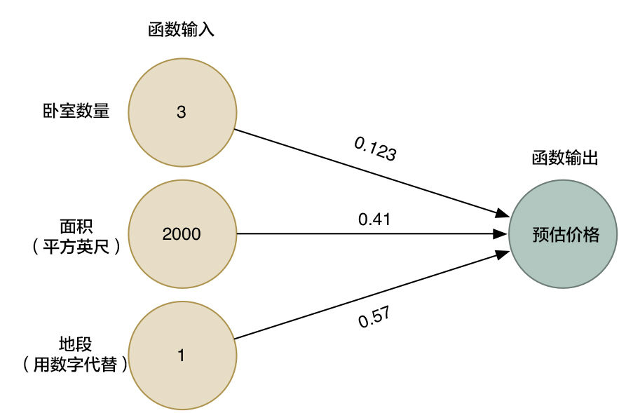

<em>箭头头表示了函数中的权重。</em>

然而，这个算法仅仅能用于处理一些简单的问题，就是那些输入和输出有着线性关系的问题。但如果真实价格和决定因素的关系并不是如此简单，那我们该怎么办？ 比如说，地段对于大户型和小户型的房屋有很大影响，然而对中等户型的房屋并没有太大影响。那我们该怎么在我们的模型中收集这种复杂的信息呢？

所以为了更加的智能化，我们可以利用不同的权重来多次运行这个算法，收集各种不同情况下的估价。

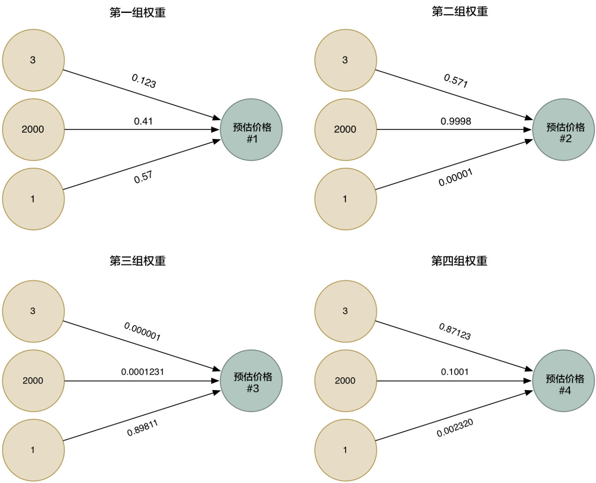

然后我们把四种整合到一起，就得到一个超级答案

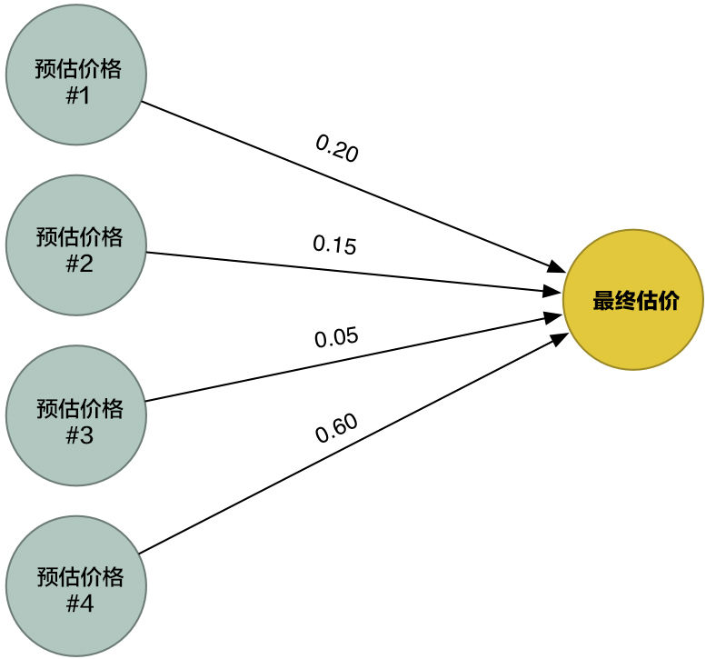

这样我们相当于得到了更为准确的答案

# 神经网络是什么

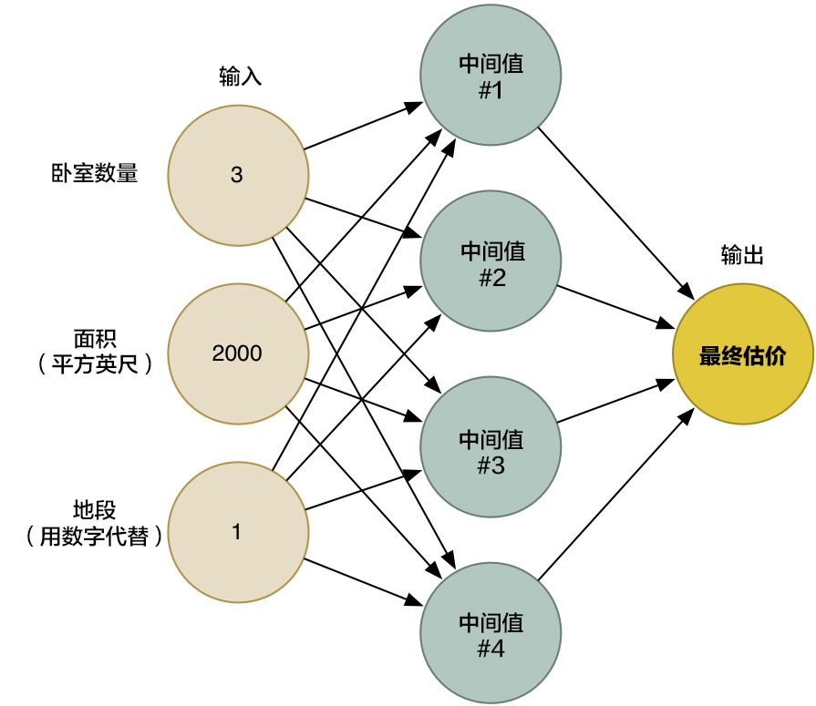

我们把四个超级网络的结合图整体画出来，其实这就是个超级简单的神经网络，虽然我们省略了很多的内容，但是他仍然有了一定的拟合能力

最重要的是下面的这些内容：

我们制造了一个权重 × 因素的简单函数，我们把这个函数叫做神经元。

通过连接许许多多的简单神经元，我们能模拟那些不能被一个神经元所模拟的函数。

通过对这些神经元的有效拼接，我们可以得到我们想要的结果。

当我用 pytorch 写对一个函数拟合时

```python
import torch

x_data =torch.Tensor ([[1.0],[2.0], [3.0]])
y_data = torch.Tensor([[2.0], [4.0], [6.0]])

class LinearModel(torch.nn.Module):
    def __init__(self):
        super(LinearModel,self).__init__()
        self.linear=torch.nn.Linear(1,1)

    def forward(self,x):
        y_pred=self.linear(x)
        return y_pred
'''
线性模型所必须的前馈传播，即wx+b
'''

model=LinearModel()
#对于对象的直接使用
criterion=torch.nn.MSELoss()
#损失函数的计算
optimizer=torch.optim.SGD(model.parameters(),lr=0.01)
#优化器
for epoch in range(100):
    y_pred=model(x_data)
    loss=criterion(y_pred,y_data)
    print(epoch,loss)

    optimizer.zero_grad()
    loss.backward()
    #反向传播
    optimizer.step()
    #数值更新
    print('w=',model.linear.weight.item())
    print('b=',model.linear.bias.item())

x_test=torch.Tensor([[4.0]])
y_test=model(x_test)
print('y_pred=',y_test.data)
```

# 由浅入深（不会涉及代码）

# 为什么不教我写代码？

因为你可能看这些基础知识感觉很轻松毫无压力，但是倘若附上很多代码，会一瞬间拉高这里的难度，虽然仅仅只是调包。

但是我还是会在上面贴上一点代码，但不会有很详细的讲解，因为很多都是调包，没什么好说的，如果你完全零基础，忽略这部分内容即可

我们尝试做一个神奇的工作，那就是用神经网络来识别一下手写数字，听上去非常不可思议，但是我要提前说的一点是，图像也不过是数据的组合，每一张图片有不同程度的像素值，如果我们把每一个像素值都当成神经网络的输入值，然后经过一个黑盒，让他识别出一个他认为可能的数字，然后进行纠正即可。

机器学习只有在你拥有数据（最好是大量数据）的情况下，才能有效。所以，我们需要有大量的手写「8」来开始我们的尝试。幸运的是，恰好有研究人员建立了 [MNIST 手写数字数据库](https://link.zhihu.com/?target=http%3A//yann.lecun.com/exdb/mnist/)，它能助我们一臂之力。MNIST 提供了 60,000 张手写数字的图片，每张图片分辨率为 18×18。即有这么多的数据。

```python
(X_train, y_train), (X_test, y_test) = mnist.load_data()
#这段是导入minist的方法，但是你看不到，如果你想看到的话需要其他操作
```

我们试着只识别一个数字 8


我们把一幅 18×18 像素的图片当成一串含有 324 个数字的数组，就可以把它输入到我们的神经网络里面了：


为了更好地操控我们的输入数据，我们把神经网络的输入节点扩大到 324 个：

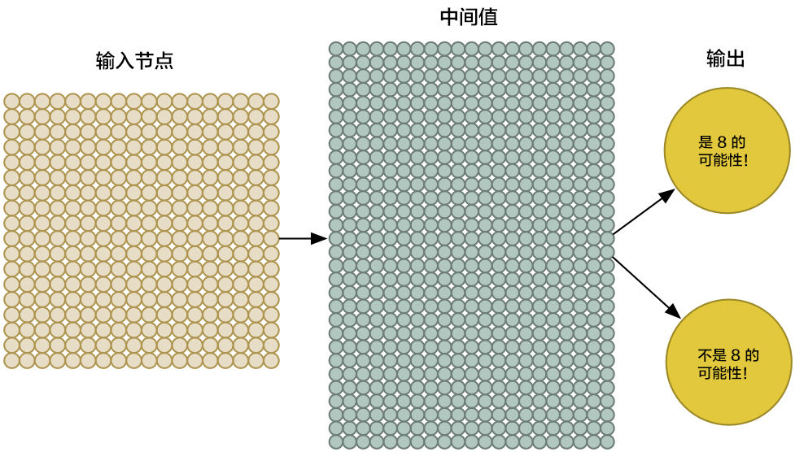

请注意，我们的神经网络现在有了两个输出（而不仅仅是一个房子的价格）。第一个输出会预测图片是「8」的概率，而第二个则输出不是「8」的概率。概括地说，我们就可以依靠多种不同的输出，利用神经网络把要识别的物品进行分组。

```python
<strong>model = Sequential([Dense(32, input_shape=(784,)), </strong>
<strong>  Activation('relu'),Dense(10),Activation('softmax')])</strong># 你也可以通过 .add() 方法简单地添加层：<strong>  model = Sequential() </strong>
<strong>  model.add(Dense(32, input_dim=784)) </strong>
<strong>  model.add(Activation('relu'))# 激活函数，你可以理解为加上这个东西可以让他效果更好</strong>
```

虽然我们的神经网络要比上次大得多（这次有 324 个输入，上次只有 3 个！），但是现在的计算机一眨眼的功夫就能够对这几百个节点进行运算。当然，你的手机也可以做到。

现在唯一要做的就是用各种「8」和非「8」的图片来训练我们的神经网络了。当我们喂给神经网络一个「8」的时候，我们会告诉它是「8」的概率是 100% ，而不是「8」的概率是 0%，反之亦然。

# 仅此而已吗

当数字并不是正好在图片中央的时候，我们的识别器就完全不工作了。一点点的位移我们的识别器就掀桌子不干了


这是因为我们的网络只学习到了正中央的「8」。它并不知道那些偏离中心的「8」长什么样子。它仅仅知道中间是「8」的图片规律。

在真实世界中，这种识别器好像并没什么卵用。真实世界的问题永远不会如此轻松简单。所以，我们需要知道，当「8」不在图片正中时，怎么才能让我们的神经网络识别它。

## 暴力方法：更多的数据和更深的网络

他不能识别靠左靠右的数据？我们都给他！给他任何位置的图片！

或者说，我们可以用一些库把图片进行一定的裁剪，翻转，甚至添加一些随机噪声。

如果这些都识别一遍，那不是都懂了吗？

当然，你同时也需要更强的拟合能力和更深的网络。

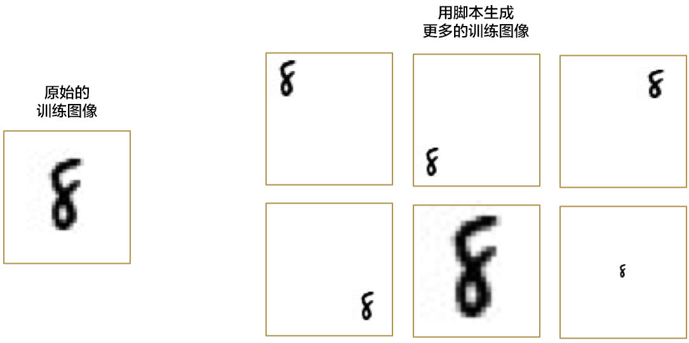


一层一层堆叠起来，这种方法很早就出现了。

## 更好的方法？

你可以通过卷积神经网络进行进一步的处理

作为人类，你能够直观地感知到图片中存在某种层级（hierarchy）或者是概念结构（conceptual structure）。比如说，你在看


你会快速的辨认出一匹马，一个人。

当这些东西换个地方出现的时候，他该是马还是马该是人还是人。

但是现在，我们的神经网络做不到这些。它认为「8」出现在图片的不同位置，就是不一样的东西。它不能理解「物体出现在图片的不同位置还是同一个物体」这个概念。这意味着在每种可能出现的位置上，它必须重新学习识别各种物体。

有人对此做过研究，人的眼睛可能会逐步判断一个物体的信息，比如说你看到一张图片，你会先看颜色，然后看纹理然后再看整体，那么我们需要一种操作来模拟这个过程，我们管这种操作叫卷积操作。


## 卷积是如何工作的

之前我们提到过，我们可以把一整张图片当做一串数字输入到神经网络里面。不同的是，这次我们会利用<strong>平移不变性</strong>的概念来把这件事做得更智能。

当然也有最新研究说卷积不具备平移不变性，但是我这里使用这个概念是为了大伙更好的理解，举个例子：你将 8 无论放在左上角还是左下角都改变不了他是 8 的事实

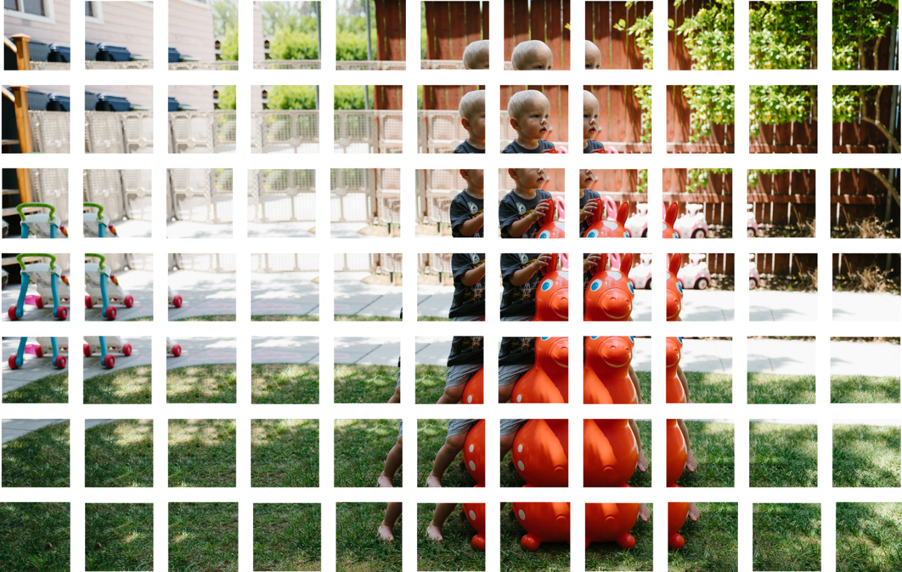

我们将一张图像分成这么多个小块，然后输入神经网络中的是一个小块。<em>每次判断一张小图块。</em>

然而，有一个非常重要的不同：对于每个小图块，我们会使用同样的神经网络权重。换一句话来说，我们平等对待每一个小图块。如果哪个小图块有任何异常出现，我们就认为这个图块是「异常」

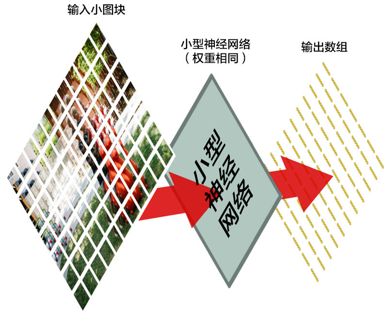

换一句话来说，我们从一整张图片开始，最后得到一个稍小一点的数组，里面存储着我们图片中的哪一部分有异常。

## 池化层

图像可能特别大。比如说 1024*1024 再来个颜色 RGB

那就有 1024*1024*3 这么多的数据，这对计算机来说去处理是不可想象的占用计算资源，所以我们需要用一种方式来降低他的计算量并且尽可能地保证丢失的数据不多。

让我们先来看每个 2×2 的方阵数组，并且留下最大的数：


每一波我们只保留一个数，这样就大大减少了图片的计算量了。

当然你也可以不选最大的，池化有很多种方式。

这损失也太大了吧！

这样子搞不会很糟糕么？确实，他会损失大量的数据，也正因如此，我们需要往里面塞大量的数据，有的数据集大的超乎你的想象，你可以自行查阅 imagenet 这种大型数据集。

当然，还有一些未公开的商用数据集，它们的数量更为庞大，运算起来更为复杂。

尽管如此，我们依然要感谢先驱，他们让一件事从能变成了不能

我们也要感谢显卡，这项技术早就出现了但是一直算不了，有了显卡让这件事成为了可能。

## 作出预测

到现在为止，我们已经把一个很大的图片缩减到了一个相对较小的数组。

你猜怎么着？数组就是一串数字而已，所以我们我们可以把这个数组输入到另外一个神经网络里面去。最后的这个神经网络会决定这个图片是否匹配。为了区分它和卷积的不同，我们把它称作「全连接」网络


我们的图片处理管道是一系列的步骤：卷积、最大池化，还有最后的「全连接」网络。

你可以把这些步骤任意组合、堆叠多次，来解决真实世界中的问题！你可以有两层、三层甚至十层卷积层。当你想要缩小你的数据大小时，你也随时可以调用最大池化函数。

我们解决问题的基本方法，就是从一整个图片开始，一步一步逐渐地分解它，直到你找到了一个单一的结论。你的卷积层越多，你的网络就越能识别出复杂的特征。

比如说，第一个卷积的步骤可能就是尝试去识别尖锐的东西，而第二个卷积步骤则是通过找到的尖锐物体来找鸟类的喙，最后一步是通过鸟喙来识别整只鸟，以此类推。

# 结语

这篇文章仅仅只是粗略的讲述了一些机器学习的一些基本操作，如果你要更深一步学习的话你可能还需要更多的探索。

# 参考资料

[machine-learning-for-software-engineers/README-zh-CN.md at master · ZuzooVn/machine-learning-for-sof](https://github.com/ZuzooVn/machine-learning-for-software-engineers/blob/master/README-zh-CN.md#%E6%9C%BA%E5%99%A8%E5%AD%A6%E4%B9%A0%E6%A6%82%E8%AE%BA)
