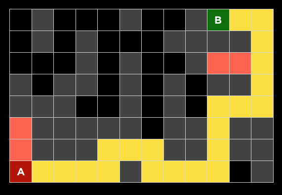

# 程序示例——maze 迷宫解搜索
::: warning 😋
阅读程序中涉及搜索算法的部分，然后运行程序，享受机器自动帮你寻找路径的快乐！

完成习题
:::
# Node

```python
# 节点类 Node
class Node:
    def __init__(self, state, parent, action):
        self.state = state        # 存储该结点的迷宫状态（即位置）
        self.parent = parent      # 存储父结点
        self.action = action      # 存储采取的行动
```

## 节点复习：

- 节点是一种包含以下数据的数据结构：
  - 状态——state
  - 其父节点，通过该父节点生成当前节点——parent node
  - 应用于父级状态以获取当前节点的操作——action
  - 从初始状态到该节点的路径成本——path cost

# 堆栈边域——DFS

```python
class StackFrontier:  # 堆栈边域
    def __init__(self):
        self.frontier = []  # 边域
    def add(self, node):  # 堆栈添加结点
        self.frontier.append(node)
    def contains_state(self, state):
        return any(node.state == state for node in self.frontier)
    def empty(self):  # 判断边域为空
        return len(self.frontier) == 0
    def remove(self):  # 移除结点
        if self.empty():
            raise Exception("empty frontier")
        else:
            node = self.frontier[-1]
            self.frontier = self.frontier[:-1]
            return node
```

## 深度优先搜索复习：

- 深度优先搜索算法在尝试另一个方向之前耗尽每个方向。在这些情况下，边域作为堆栈数据结构进行管理。这里需要记住的流行语是“后进先出”。在将节点添加到边域后，第一个要删除和考虑的节点是最后一个要添加的节点。这导致了一种搜索算法，该算法在第一个方向上尽可能深入，直到尽头，同时将所有其他方向留到后面。“不撞南墙不回头”

# 队列边域——BFS

```python
class QueueFrontier(StackFrontier):  # 队列边域
    def remove(self):
        if self.empty():
            raise Exception("empty frontier")
        else:
            node = self.frontier[0]
            self.frontier = self.frontier[1:]
            return node
```

## 广度优先搜索复习：

- 广度优先搜索算法将同时遵循多个方向，在每个可能的方向上迈出一步，然后在每个方向上迈出第二步。在这种情况下，边域作为队列数据结构进行管理。这里需要记住的流行语是“先进先出”。在这种情况下，所有新节点都会排成一行，并根据先添加的节点来考虑节点（先到先得！）。这导致搜索算法在任何一个方向上迈出第二步之前，在每个可能的方向上迈出一步。

# 迷宫解——Maze_solution

```python
class Maze:
    def __init__(self, filename):  # 读入迷宫图
        # 读入文件，设置迷宫大小
        with open(filename) as f:
            contents = f.read()
        # 验证起点和目标
        if contents.count("A") != 1:
            raise Exception("maze must have exactly one start point")
        if contents.count("B") != 1:
            raise Exception("maze must have exactly one goal")
        # 绘制迷宫大小
        contents = contents.splitlines()
        self.height = len(contents)
        self.width = max(len(line) for line in contents)
        # 绘制迷宫墙，起点，终点
        self.walls = []
        for i in range(self.height):
            row = []
            for j in range(self.width):
                try:
                    if contents[i][j] == "A":    # 设置起点
                        self.start = (i, j)
                        row.append(False)
                    elif contents[i][j] == "B":
                        self.goal = (i, j)       # 设置终点
                        row.append(False)
                    elif contents[i][j] == " ":
                        row.append(False)        # 设置墙体
                    else:
                        row.append(True)         # 可移动的点为 True
                except IndexError:
                    row.append(False)
            self.walls.append(row)
        self.solution = None
    # 打印结果
    def print(self):
        ...
    # 寻找邻结点，返回元组(动作，坐标(x,y))
    def neighbors(self, state):
        row, col = state
        candidates = [
            ("up", (row - 1, col)),
            ("down", (row + 1, col)),
            ("left", (row, col - 1)),
            ("right", (row, col + 1))
        ]
        result = []
        for action, (r, c) in candidates:
            if 0 <= r < self.height and 0 <= c < self.width and not self.walls[r][c]:
                result.append((action, (r, c)))
        return result
    def solve(self):
        # 搜索迷宫解
        self.num_explored = 0   # 已搜索的路径长度
        # 将边界初始化为起始位置
        start = Node(state=self.start, parent=None, action=None)
        frontier = StackFrontier()  # 采用DFS
        # frontier = QueueFrontier()  # 采用BFS
        frontier.add(start)
        # 初始化一个空的探索集
        self.explored = set()  # 存储已搜索的结点
        # 保持循环直到找到解决方案
        while True:
            # 无解情况
            if frontier.empty():
                raise Exception("no solution")
            # 从边界中选择一个节点
            node = frontier.remove()
            self.num_explored += 1
            # 得到解决路径
            if node.state == self.goal:
                actions = []
                cells = []
                while node.parent is not None:  # 遍历父节点得到路径动作
                    actions.append(node.action) 
                    cells.append(node.state)
                    node = node.parent
                actions.reverse()
                cells.reverse()
                self.solution = (actions, cells)
                return
            # 将节点标记为已探索
            self.explored.add(node.state)
            # 将邻居添加到边界（展开节点）
            for action, state in self.neighbors(node.state):
                if not frontier.contains_state(state) and state not in self.explored:
                    child = Node(state=state, parent=node, action=action)
                    frontier.add(child)
    def output_image(self, filename, show_solution=True, show_explored=False):
        ...
```

# Quiz

1. 在深度优先搜索（DFS）和广度优先搜索（BFS）之间，哪一个会在迷宫中找到更短的路径？
   1. DFS 将始终找到比 BFS 更短的路径
   2. BFS 将始终找到比 DFS 更短的路径
   3. DFS 有时（但并非总是）会找到比 BFS 更短的路径
   4. BFS 有时（但并非总是）会找到比 DFS 更短的路径
   5. 两种算法总是能找到相同长度的路径
2. 下面的问题将问你关于下面迷宫的问题。灰色单元格表示墙壁。在这个迷宫上运行了一个搜索算法，找到了从 A 点到 B 点的黄色突出显示的路径。在这样做的过程中，红色突出显示的细胞是探索的状态，但并没有达到目标。

    

    在讲座中讨论的四种搜索算法中——深度优先搜索、广度优先搜索、曼哈顿距离启发式贪婪最佳优先搜索和曼哈顿距离启发式$A^*$

    搜索——可以使用哪一种（或多种，如果可能的话）？
   1. 只能是$A^*$
   2. 只能是贪婪最佳优先搜索
   3. 只能是 DFS
   4. 只能是 BFS
   5. 可能是$A^*$或贪婪最佳优先搜索
   6. 可以是 DFS 或 BFS
   7. 可能是四种算法中的任何一种
   8. 不可能是四种算法中的任何一种
3. 为什么有深度限制的极大极小算法有时比没有深度限制的极大极小更可取？
   1.  深度受限的极大极小算法可以更快地做出决定，因为它探索的状态更少
   2.  深度受限的极大极小算法将在没有深度限制的情况下实现与极大极小算法相同的输出，但有时会使用较少的内存
   3.  深度受限的极大极小算法可以通过不探索已知的次优状态来做出更优化的决策
   4.  深度限制的极小极大值永远不会比没有深度限制的极大极小值更可取
4.  下面的问题将询问您关于下面的 Minimax 树，其中绿色向上箭头表示 MAX 玩家，红色向下箭头表示 MIN 玩家。每个叶节点都标有其值。


根节点的值是多少？

- 2
- 3
- 4
- 5
- 6
- 7
- 8
- 9