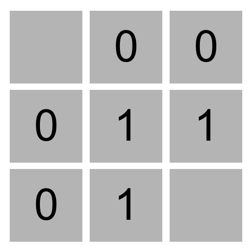
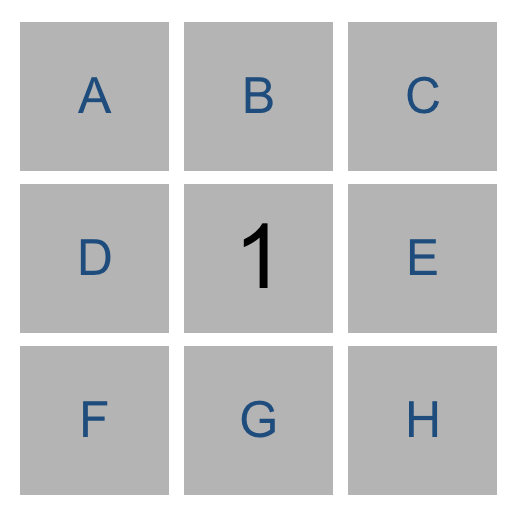
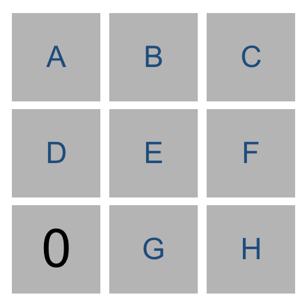
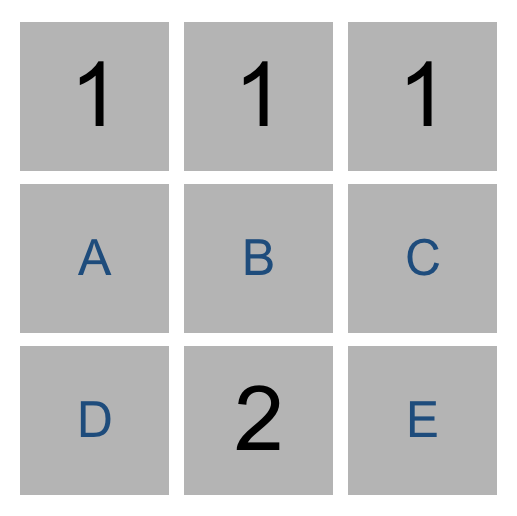

# 项目：扫雷，骑士与流氓问题

我们为你提供了两个简单有趣的项目，帮助你进行知识巩固，请认真阅读文档内容。

如果你卡住了，请记得回来阅读文档，或请求身边人的帮助。

`pip3 install -r requirements.txt`

# 骑士与流氓问题

## 背景

- 在 1978 年，逻辑学家雷蒙德·斯穆里安（Raymond Smullyan）出版了《这本书叫什么名字？》，这是一本逻辑难题的书。在书中的谜题中，有一类谜题被斯穆里安称为“骑士与流氓”谜题。
- 在骑士与流氓谜题中，给出了以下信息：每个角色要么是骑士，要么是流氓。骑士总是会说实话：如果骑士陈述了一句话，那么这句话就是真的。相反，流氓总是说谎：如果流氓陈述了一个句子，那么这个句子就是假的。
- 谜题的目标是，给出每个角色说的一组句子，确定每个角色是骑士还是流氓。
- 比如，这里有一个简单的谜题只有一个名为 A 的角色。A 说：“我既是骑士又是流氓。”
- 从逻辑上讲，我们可以推断，如果 A 是骑士，那么这句话一定是真的。但我们知道这句话不可能是真的，因为 A 不可能既是骑士又是流氓——我们知道每个角色要么是骑士，要么是流氓，不会出现是流氓的骑士或是骑士的流氓。所以，我们可以得出结论，A 一定是流氓。
- 那个谜题比较简单。随着更多的字符和更多的句子，谜题可以变得更加棘手！你在这个问题中的任务是确定如何使用命题逻辑来表示这些谜题，这样一个运行模型检查算法的人工智能可以为我们解决这些谜题。

## 理解

- 看一下 `logic.py`，你可能还记得讲义的内容。无需了解此文件中的所有内容，但请注意，此文件为不同类型的逻辑连接词定义了多个类。这些类可以相互组合，所以表达式 `And(Not(A), Or(B, C))` 代表逻辑语句：命题 A 是不正确的，同时，命题 B 或者命题 C 是正确的。（这里的“或”是同或，不是异或）
- 回想一下 `logic.py`，它还包含一个 函数 `model_check` 。`model_check` 输入知识库和查询结论。知识库是一个逻辑命题：如果知道多个逻辑语句，则可以将它们连接在一个表达式中。 递归考虑所有可能的模型，如果知识库推理蕴含查询结论，则返回 `True`，否则返回 `False`。
- 现在，看看 `puzzle.py`，在顶部，我们定义了六个命题符号。例如，`AKnight` 表示“A 是骑士”的命题，`AKnave` 而表示“A 是流氓”的句子。我们也为字符 B 和 C 定义了类似的命题符号。
- 接下来是四个不同的知识库 `knowledge0`, `knowledge1`, `knowledge2`, and `knowledge3`，它们将分别包含推断即将到来的谜题 0、1、2 和 3 的解决方案所需的知识。请注意，目前，这些知识库中的每一个都是空的。这就是你进来的地方！
- 这个 `puzzle.py` 的 `main` 函数在所有谜题上循环，并使用模型检查来计算，给定谜题的知识，无论每个角色是骑士还是无赖，打印出模型检查算法能够得出的任何结论。

## 明确

- 将知识添加到知识库 `knowledge0`, `knowledge1`, `knowledge2`, 和 `knowledge3` 中，以解决以下难题。

  - 谜题 0 是背景中的谜题。它只包含一个简单的角色 A

A 说：“我既是骑士又是流氓。”

- 谜题 1 有两个角色：A 和 B

A 说：“我们都是流氓。”

B 什么都没说。

- 谜题 2 有两个角色：A 和 B

A 说：“我们是同一种身份。”

B 说：“我们不是同一种身份。”

- 谜题 3 有三个角色：A，B 和 C

A 说：“我是骑士”或者 A 说：“我是流氓”（这里“或”是异或，不是同或），但你不知道 A 说的是哪句话。

B 说：“A 说过‘我是流氓’。”

B 又说：“C 是流氓。”

C 说：“A 是骑士。”

- 上述每个谜题中，每个角色要么是骑士，要么是流氓。骑士说的每一句话都是真的，流氓说的每一句话都是假的。
- 一旦你完成了一个问题的知识库，你应该能够运行 `python puzzle.py` 来查看谜题的解决方案。

## 提示

- 对于每个知识库，你可能想要编码两种不同类型的信息：（1）关于问题本身结构的信息（即骑士与流氓谜题定义中给出的信息），以及（2）关于角色实际说了什么的信息。
- 考虑一下，如果一个句子是由一个角色说出的，这意味着什么。在什么条件下这句话是真的？在什么条件下这个句子是假的？你如何将其表达为一个合乎逻辑的句子？
- 每个谜题都有多个可能的知识库，可以计算出正确的结果。你应该尝试选择一个能对谜题中的信息进行最直接的知识库，而不是自己进行逻辑推理。你还应该考虑谜题中信息最简洁的表达方式是什么。

  - 例如，对于谜题 0，设置 `knowledge0=AKnave` 将产生正确的输出，因为通过我们自己的推理，我们知道 A 一定是一个无赖。但这样做违背了这个问题的精神：目标是让你的人工智能为你做推理。
- 您不需要（也不应该）修改 `logic.py` 来完成这个问题。

# 扫雷

写一个 AI 来玩扫雷游戏。


## 背景

### 扫雷

- 扫雷器是一款益智游戏，由一个单元格网格组成，其中一些单元格包含隐藏的“地雷”。点击包含地雷的单元格会引爆地雷，导致用户输掉游戏。单击“安全”单元格（即不包含地雷的单元格）会显示一个数字，指示有多少相邻单元格包含地雷，其中相邻单元格是指从给定单元格向左、向右、向上、向下或对角线一个正方形的单元格。
- 例如，在这个 3x3 扫雷游戏中，三个 1 值表示这些单元格中的每个单元格都有一个相邻的单元格，该单元格是地雷。四个 0 值表示这些单元中的每一个都没有相邻的地雷。



- 给定这些信息，玩家根据逻辑可以得出结论，右下角单元格中一定有地雷，左上角单元格中没有地雷，因为只有在这种情况下，其他单元格上的数字标签才会准确。
- 游戏的目标是标记（即识别）每个地雷。在游戏的许多实现中，包括本项目中的实现中，玩家可以通过右键单击单元格（或左键双击，具体取决于计算机）来标记地雷。

### 命题逻辑

- 你在这个项目中的目标是建立一个可以玩扫雷游戏的人工智能。回想一下，基于知识的智能主体通过考虑他们的知识库来做出决策，并根据这些知识做出推断。
- 我们可以表示人工智能关于扫雷游戏的知识的一种方法是，使每个单元格成为命题变量，如果单元格包含地雷，则为真，否则为假。



- 我们现在掌握了什么信息？我们现在知道八个相邻的单元格中有一个是地雷。因此，我们可以写一个逻辑表达式，如下所示，表示其中一个相邻的单元格是地雷。
- `Or(A,B,C,D,E,F,G,H)`
- 但事实上，我们知道的比这个表达所说的要多。上面的逻辑命题表达了这样一种观点，即这八个变量中至少有一个是真的。但我们可以做一个更有力的陈述：我们知道八个变量中有一个是真的。这给了我们一个命题逻辑命题，如下所示。

```
Or(
    And(A, Not(B), Not(C), Not(D), Not(E), Not(F), Not(G), Not(H)),
    And(Not(A), B, Not(C), Not(D), Not(E), Not(F), Not(G), Not(H)),
    And(Not(A), Not(B), C, Not(D), Not(E), Not(F), Not(G), Not(H)),
    And(Not(A), Not(B), Not(C), D, Not(E), Not(F), Not(G), Not(H)),
    And(Not(A), Not(B), Not(C), Not(D), E, Not(F), Not(G), Not(H)),
    And(Not(A), Not(B), Not(C), Not(D), Not(E), F, Not(G), Not(H)),
    And(Not(A), Not(B), Not(C), Not(D), Not(E), Not(F), G, Not(H)),
    And(Not(A), Not(B), Not(C), Not(D), Not(E), Not(F), Not(G), H)
)
```

- 这是一个相当复杂的表达！这只是为了表达一个单元格中有 1 意味着什么。如果一个单元格有 2、3 或其他值，这个表达式可能会更长。
- 试图对这类问题进行模型检查也会很快变得棘手：在 8x8 网格（微软初级游戏模式使用的大小）上，我们有 64 个变量，因此需要检查
  $$
  2^64
  $$

  个可能的模型——太多了，计算机无法在任何合理的时间内计算。对于这个问题，我们需要更好地表达知识。

### 知识表示

- 相反，我们将像下面这样表示人工智能知识的每一句话。
- `{A, B, C, D, E, F, G, H} = 1`
- 这种表示法中的每个逻辑命题都有两个部分：一个是网格中与提示数字有关的一组单元格 `cell`，另一个是数字计数 `count`，表示这些单元格中有多少是地雷。上面的逻辑命题说，在单元格 A、B、C、D、E、F、G 和 H 中，正好有 1 个是地雷。
- 为什么这是一个有用的表示？在某种程度上，它很适合某些类型的推理。考虑下面的游戏。



- 利用左下数的知识，我们可以构造命题 `{D，E，G}=0`，意思是在 D、E 和 G 单元中，正好有 0 个是地雷。凭直觉，我们可以从这句话中推断出所有的单元格都必须是安全的。通过推理，每当我们有一个 `count` 为 0 的命题时，我们就知道该命题的所有 `cell` 都必须是安全的。
- 同样，考虑下面的游戏。


- 我们的人工智能会构建命题 `{E，F，H}=3`。凭直觉，我们可以推断出所有的 E、F 和 H 都是地雷。更一般地说，任何时候 `cell` 的数量等于 `count`，我们都知道这个命题的所有单元格都必须是地雷。
- 一般来说，我们只希望我们的命题是关于那些还不知道是安全的还是地雷的 `cell`。这意味着，一旦我们知道一个单元格是否是地雷，我们就可以更新我们的知识库来简化它们，并可能得出新的结论。
- 例如，如果我们的人工智能知道命题 `{A，B，C}=2`，那么我们还没有足够的信息来得出任何结论。但如果我们被告知 C 是安全的，我们可以将 C 从命题中完全删除，留下命题 `{A，B}=2`（顺便说一句，这确实让我们得出了一些新的结论）
- 同样，如果我们的人工智能知道命题 `{A，B，C}＝2`，并且我们被告知 C 是一颗地雷，我们可以从命题中删除 C，并减少计数的值（因为 C 是导致该计数的地雷），从而得到命题 `{A、B}＝1`。这是合乎逻辑的：如果 A、B 和 C 中有两个是地雷，并且我们知道 C 是地雷，那么 A 和 B 中一定有一个是地雷。
- 如果我们更聪明，我们可以做最后一种推理。



- 考虑一下我们的人工智能根据中间顶部单元格和中间底部单元格会知道的两个命题。从中上角的单元格中，我们得到 `{A，B，C}=1`。从底部中间单元格中，我们得到 `{A，B，C，D，E}=2`。从逻辑上讲，我们可以推断出一个新的知识，即 `{D，E}＝1`。毕竟，如果 A、B、C、D 和 E 中有两个是地雷，而 A、B 和 C 中只有一个是地雷的话，那么 D 和 E 必须是另一个地雷。
- 更一般地说，任何时候我们有两个命题满足 `set1=count1` 和 `set2=count2`，其中 `set1` 是 `set2` 的子集，那么我们可以构造新的命题 `set2-set1=count2-count1`。考虑上面的例子，以确保你理解为什么这是真的。
- 因此，使用这种表示知识的方法，我们可以编写一个人工智能智能主体，它可以收集有关扫雷的知识，并希望选择它知道安全的单元格！

## 理解

- 这个项目有两个主要文件：`runner.py` 和 `minesweeper.py`。`minesweeper.py` 包含游戏本身和 AI 玩游戏的所有逻辑。`runner.py` 已经为你实现，它包含了运行游戏图形界面的所有代码。一旦你完成了 `minesweeper.py` 中所有必需的功能，你就可以运行 `python runner.py` 来玩扫雷了（或者让你的 AI 为你玩）！
- 让我们打开 `minesweeper.py` 来了解提供了什么。这个文件中定义了三个类，`Minesweeper`，负责处理游戏；`Sentence`，表示一个既包含一组 `cell` 又包含一个 `count` 的逻辑命题；以及 `MinesweeperAI`，它处理根据知识做出的推断。
- `Minesweeper` 类已经完全实现了。请注意，每个单元格都是一对 `(i，j)`，其中 `i` 是行号(范围从 `0` 到 `height-1`)，`j` 是列号(范围从 `0` 到 `width-1`)。
- `Sentence` 类将用于表示背景中描述的形式的逻辑命题。每个命题中都有一组 `cell`，以及 `count` 表示其中有多少单元格是地雷。该类还包含函数 `known_mines` 和 `known_safes`，用于确定命题中的任何单元格是已知的地雷还是已知的安全单元格。它还包含函数 `mark_mine` 和 `mark_safe`，用于响应有关单元格的新信息来更新命题。
- 最后，`MinesweeperAI` 类将实现一个可以玩扫雷的 AI。AI 类跟踪许多值。`self.moves_made` 包含一组已经点击过的所有单元格，因此人工智能知道不要再选择这些单元格。`self.mines` 包含一组已知为地雷的所有单元格。`self.safes` 包含一组已知安全的所有单元格。而 `self.knowledge` 包含了人工智能知道是真的所有命题的列表。
- `mark_mine` 函数为 `self.mines` 添加了一个单元格，因此 AI 知道这是一个地雷。它还循环遍历人工智能知识中的所有命题，并通知每个命题该单元格是地雷，这样，如果命题包含有关地雷的信息，它就可以相应地更新自己。`mark_safe` 函数也做同样的事情，只是针对安全单元格。
- 剩下的函数 `add_knowledge`、`make_safe_move` 和 `make_random_move` 由你完成！

## 明确

- 完成 `minesweeper.py` 中的 `Sentence` 类和 `MinesweeperAI` 类的实现。
- 在 `Sentence` 类中，完成 `known_mines`、`known_safes`、`mark_mine` 和 `mark_safe` 的实现。

  - `known_mines` 函数应该返回 `self.cells` 中已知为地雷的所有单元格的集合。
  - `known_safes` 函数应该返回 `self.cells` 中已知安全的所有单元格的集合。
  - `mark_mine` 函数应该首先检查单元格是否是命题中包含的单元格之一。

    - 如果 `cell` 在命题中，函数应该更新命题，使单元格不再在命题中但仍然表示一个逻辑正确的命题，因为该 `cell` 已知是地雷。
    - 如果命题中没有 `cell`，则不需要采取任何行动。
  - `mark_safe` 函数应该首先检查单元格是否是命题中包含的单元格之一。

    - 如果 `cell` 在命题中，则函数应更新命题，使单元格不再在命题中但仍然表示一个逻辑正确的命题，因为该 `cell` 已知是安全的。
    - 如果命题中没有 `cell`，则不需要采取任何行动。
- 在 `MinesweeperAI` 类中，完成 `add_knowledge`、`make_safe_move` 和 `make_random_move` 的实现。

  - `add_knowledge` 应该接受一个单元格（表示为元组 `(i，j)`）及其相应的 `count`，并使用 AI 可以推断的任何新信息更新 `self.mines`、`self.safes`、`self.moves_made` 和 `self.knowledge`，因为该单元格是已知的安全单元格，其附近有计数地雷。

    - 该函数应将该 `cell` 标记为游戏中的一个动作。
    - 函数应该将 `cell` 标记为安全单元格，同时更新包含该单元格的任何命题。
    - 该函数应该根据 `cell` 和 `count` 的值，在人工智能的知识库中添加一个新命题，以表明 `cell` 的邻居有 `count` 是地雷。请确保在命题中只包含状态尚未确定的单元格。
    - 如果根据 `self.knowledge` 中的任何一个命题，新的单元格可以被标记为安全的或地雷，那么函数应该这样做。
    - 如果根据 `self.knowledge` 中的任何一个命题，可以推断出新的命题（使用背景技术中描述的子集方法），那么这些命题也应该添加到知识库中。
    - 请注意，每当你对人工智能的知识做出任何改变时，都有可能得出以前不可能的新推论。如果可能的话，请确保将这些新的推断添加到知识库中。
- `make_safe_move` 应该返回一个已知安全的选择 `(i，j)`。

  - 必须知道返回的动作是安全的，而不是已经做出的动作。
  - 如果无法保证安全移动，则函数应返回 `None`。
  - 该函数不应修改 `self.moves_made`、`self.mines`、`self.safes` 或 `self.knowledge`。
- `make_random_move` 应该返回一个随机选择 `(i，j)`。

  - 如果无法安全移动，将调用此功能：如果人工智能不知道移动到哪里，它将选择随机移动。
  - 此举不得是已经采取的行动。
  - 此举决不能是已知的地雷行动。
  - 如果无法进行此类移动，则函数应返回 `None`。

## 提示

- 确保你已经彻底阅读了背景部分，以了解知识在这个人工智能中是如何表现的，以及人工智能是如何进行推理的。
- 如果对面向对象编程感觉不太舒服，你可能会发现<u>python 关于类</u>的文档很有帮助。
- 你可以在<u>python 关于集合</u>的文档中找到一些常见的集合操作。
- 在 `Sentence` 类中实现 `known_mines` 和 `known_safes` 时，请考虑：在什么情况下，你确信命题的单元格是安全的？在什么情况下，你确定一个命题的单元格是地雷？
- `add_knowledge` 做了很多工作，可能是迄今为止你为该项目编写的最长的函数。一步一步地实现此函数的行为可能会有所帮助。
- 如果愿意，欢迎您向任何类添加新方法，但不应修改任何现有函数的定义或参数。
- 当你运行你的人工智能（如点击“AI Move”）时，请注意它并不总是获胜！在某些情况下，人工智能必须进行猜测，因为它缺乏足够的信息来进行安全行动。这是意料之中的事。`runner.py` 将打印人工智能是否正在进行其认为安全的移动，或者是否正在进行随机移动。
- 在对集合进行迭代时，请注意不要修改它。这样做可能会导致错误！
