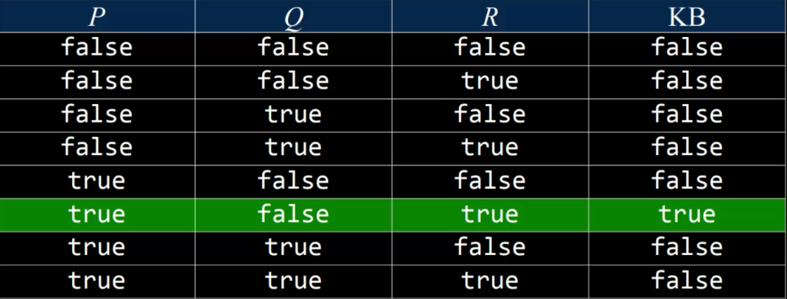
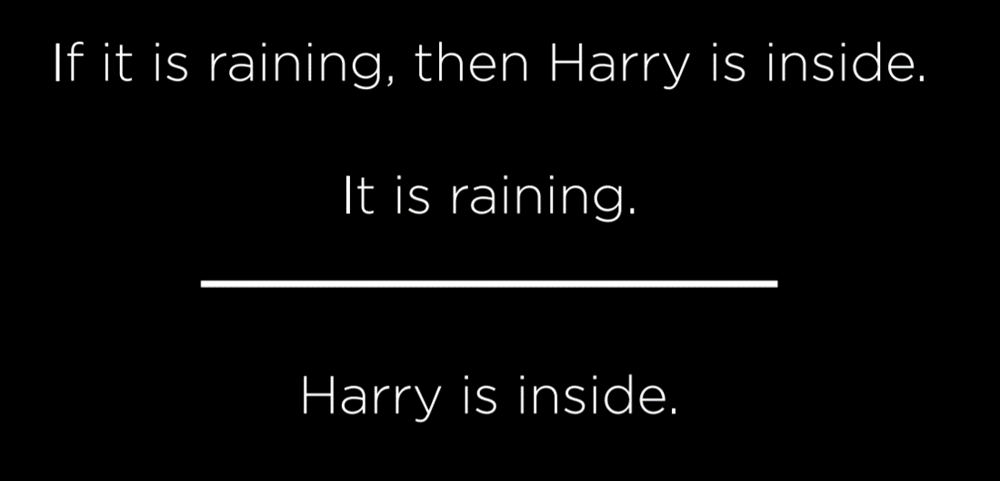
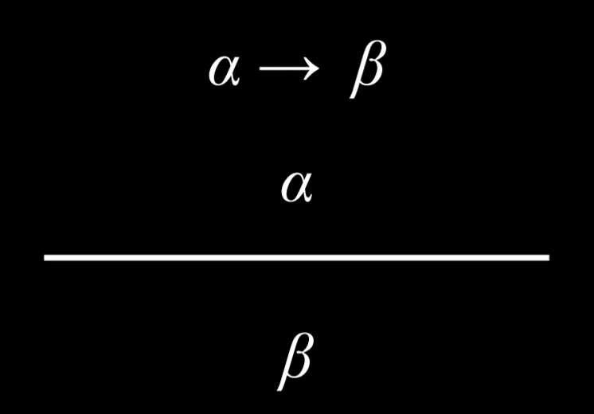
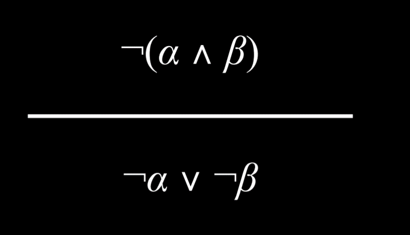
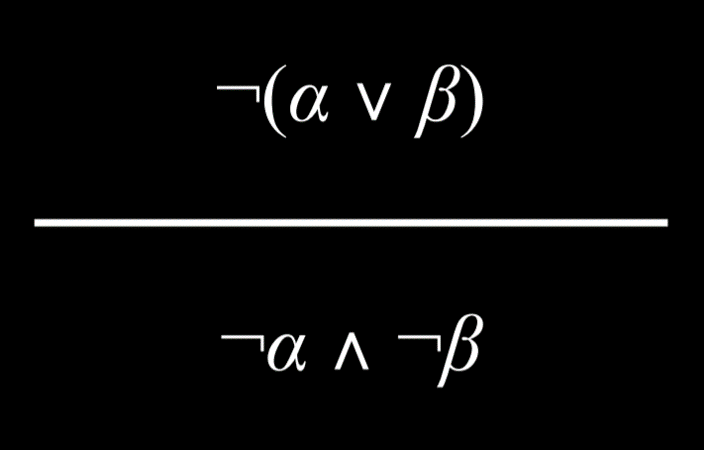
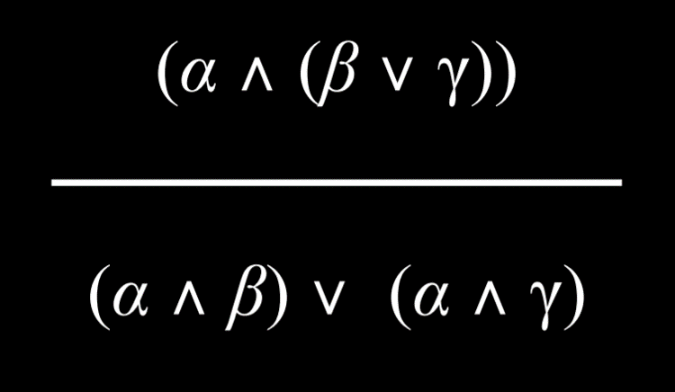
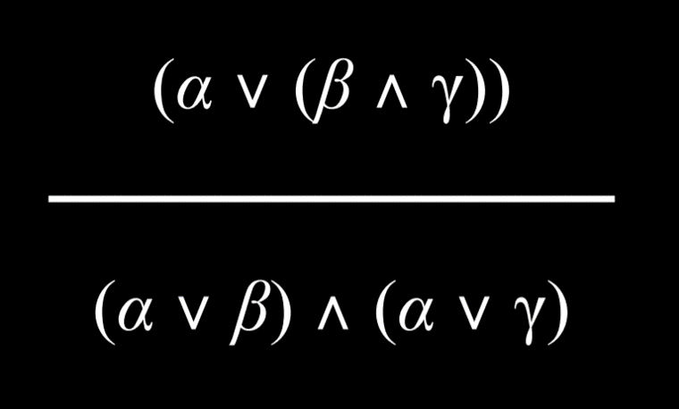
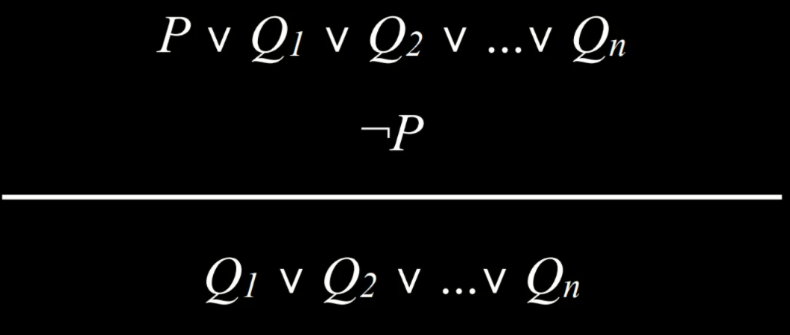
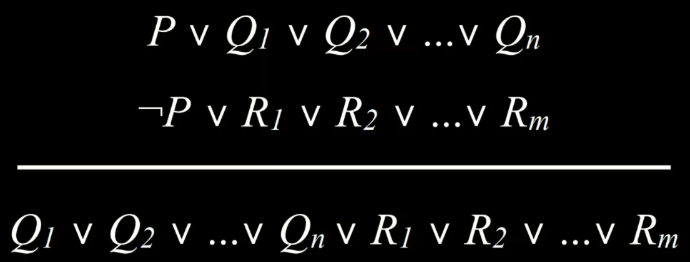

# 知识推理

人类根据现有的知识进行推理并得出结论。表示知识并从中得出结论的概念也被用于人工智能中，在本章中我们将探讨如何实现这种行为。
::: warning 😱
# 说好的 AI 呢？怎么感觉越来越偏了？

如果有这样的疑问的同学，可能存在一定的误区，认为人工智能就是局限在深度学习的算法或者说机器学习的部分算法上，其实这是对这个领域一个巨大的误解。

在 AI 的发展历程上，曾经存在一次符号主义（Symbolic）与联结主义（Connectionism）之争。

联结主义的中心原则是使用，简单且经常一致的单元互联网络，来描述各种现象，即简单的复杂叠加。在目前的深度学习网络中有着最为广泛的应用。

符号主义则相信，智能的许多特征可以透过[符号](https://zh.wikipedia.org/wiki/%E7%89%A9%E7%90%86%E7%AC%A6%E8%99%9F%E7%B3%BB%E7%B5%B1)处理来实现。最为显著的应用即是早期的专家系统。

从本质上来说，二者都存在用机器可以理解的语言表征知识，随后让机器依照人为制定的理论或数据依照概率或推理得到人所期望获得的的知识或结果。

而在本章的内容中，知识推理目标是让机器存储相应的知识，并且能够按照某种规则推理演绎得到新的知识，与 AI 的主体逻辑是相融洽的。目前的主流 AI 领域，知识图谱的重要组成部分，便包括了知识推理这个步骤，即从已知到未知。

那么如何构建让计算机可以理解的知识体系呢？如何让机器从已告知他的逻辑延伸到未告知他逻辑呢？数学家和计算机科学家甚至为此构建了相较而言非常完善的理论体系，包括但不限于离散数学，计算理论甚至是抽象数学，我在最后补充三本阅读材料，各位如果想要深入了解，可以进行进一步的阅读和理解。

较为基础的知识各位可以看以下的内容。
:::
# 基础知识

- 基于知识的智能主体(Knowledge-Based Agents)
  - 智能主体通过对内部的知识表征进行操作来推理得出结论。
  - “根据知识推理得出结论”是什么意思？
  - 让我们开始用哈利波特的例子来回答这个问题。 考虑以下句子：
    1. 如果没有下雨，哈利今天会去拜访海格。
    2. 哈利今天拜访了海格或邓布利多，但没有同时拜访他们。
    3. 哈利今天拜访了邓布利多。
  - 基于这三个句子，我们可以回答“今天下雨了吗？”这个问题，尽管没有一个单独的句子告诉我们今天是否下雨，根据推理我们可以得出结论“今天下雨了”。
- 陈述句(Sentence)
  - 陈述句是知识表示语言中关于世界的断言。 陈述句是人工智能存储知识并使用它来推断新信息的方式。

# 命题逻辑(Propositional Logic)

命题逻辑基于命题。命题是关于世界的陈述，可以是真也可以是假，正如上面例子中的句子。

- 命题符号(Propositional Symbols)
  - 命题符号通常是用于表示命题的字母$P、Q、R$
- 逻辑连接词(Logical Connectives)
  - 逻辑连接词是连接命题符号的逻辑符号，以便以更复杂的方式对世界进行推理。
  - <strong>Not</strong><strong> </strong><strong>(</strong>$\lnot$<strong>)</strong> 逻辑非: 命题真值的反转。 例如，如果 $P$：“正在下雨”，那么 $¬P$：“没有下雨”。
    - 真值表用于将所有可能的真值赋值与命题进行比较。 该工具将帮助我们更好地理解与不同逻辑连接词相关联的命题的真值。 例如，下面是我们的第一个真值表：

    | $P$      | $\lnot P$ |
    | -------- | --------- |
    | false(0) | true(1)   |
    | true(1)  | false(0)  |

- <strong>And(</strong>$\land$<strong>)</strong> 逻辑乘(合取): 连接两个不同的命题。 当这两个命题$P$和$Q$用$∧$连接时，得到的命题$P∧Q$只有在$P$和$Q$都为真的情况下才为真。

  | $P$ | $Q$ | $P\land Q$ |
  | --- | --- | ---------- |
  | 0   | 0   | 0          |
  | 0   | 1   | 0          |
  | 1   | 0   | 0          |
  | 1   | 1   | 1          |

- <strong>Or(</strong>$\lor$<strong>)</strong> 逻辑和(析取): 只要它的任何一个参数为真，它就为真。 这意味着要使 $P ∨ Q$为真，$P$ 或 $Q$ 中至少有一个必须为真。

  | $P$ | $Q$ | $P\lor Q$ |
  | --- | --- | --------- |
  | 0   | 0   | 0         |
  | 0   | 1   | 1         |
  | 1   | 0   | 1         |
  | 1   | 1   | 1         |


  - 值得一提的是，Or有两种类型：同或Or和异或Or。在异或中，如果$P\lor Q$为真，则$P∧Q$为假。也就是说，一个异或要求它只有一个论点为真，而不要求两者都为真。如果$P、Q$或$P∧Q$中的任何一个为真，则包含或为真。在Or($\lor$)的情况下，意图是一个包含的Or。

- <strong>Implication (→)</strong> 逻辑蕴含: 表示“如果$P$，则$Q$的结构。例如，如果$P$：“正在下雨”，$Q$：“我在室内”，则$P→ Q$的意思是“如果下雨，那么我在室内。”在$P$的情况下，意味着$Q$，$P$被称为前件，$Q$ 被称为后件。

  - 当前件为真时，在后件为真的情况下，整个蕴含逻辑为真（这是有道理的：如果下雨，我在室内，那么“如果下雨，那么我在室内”这句话是真的）。当前件为真时，如果后件为假，则蕴含逻辑为假（如果下雨时我在外面，那么“如果下雨，那么我在室内”这句话是假的）。然而，当前件为假时，无论后件如何，蕴含逻辑总是真的。这有时可能是一个令人困惑的概念。从逻辑上讲，我们不能从蕴含中学到任何东西$(P→ Q)$如果前件($P$)为假。看一下我们的例子，如果没有下雨，这个蕴含逻辑并没有说我是否在室内的问题。我可能是一个室内型的人，即使不下雨也不在外面走，或者我可能是一个室外型的人，不下雨的时候一直在外面。当前件是假的，我们说蕴含逻辑是真的。

    | $P$ | $Q$ | $P\to Q$ |
    | --- | --- | -------- |
    | 0   | 0   | 1        |
    | 0   | 1   | 1        |
    | 1   | 0   | 0        |
    | 1   | 1   | 1        |

- <strong>Biconditional (</strong>$\leftrightarrow$<strong>)</strong> :是一个双向的蕴含。你可以把它读成“如果且仅当”$P↔ Q$等同$P→ Q$和$Q→ P$合在一起。例如，如果$P$：“正在下雨”，$Q$：“我在室内”，那么$P↔ Q$的意思是“如果下雨，那么我在室内”，“如果我在室内，那么就在下雨。”这意味着我们可以推断出比简单蕴含更多的东西。如果$P$为假，那么$Q$ 也为假；如果不下雨，我们知道我也不在室内。
  
  | $P$ | $Q$ | $P\leftrightarrow Q$ |
  | --- | --- | -------------------- |
  | 0   | 0   | 1                    |
  | 0   | 1   | 0                    |
  | 1   | 0   | 0                    |
  | 1   | 1   | 1                    |

- 模型(Model)
  - 模型是对每个命题的真值赋值。 重申一下，命题是关于世界的陈述，可以是真也可以是假。 然而，关于世界的知识体现在这些命题的真值中。 模型是提供有关世界的信息的真值赋值。
  - 例如，如果 $P$：“正在下雨。” 和 $Q$：“今天是星期二。”，模型可以是以下真值赋值：$\set{P = True, Q = False}$。 此模型表示正在下雨，但不是星期二。 然而，在这种情况下有更多可能的模型（例如，$\set{P = True, Q = True}$，星期二并且下雨）。 事实上，可能模型的数量是命题数量的 2 次方。 在这种情况下，我们有 2 个命题，所以 $2^2=4$ 个可能的模型。
- 知识库(Knowledge Base (KB))
  - 知识库是基于知识的智能主题已知的一组陈述句。 这是关于人工智能以命题逻辑语句的形式提供的关于世界的知识，可用于对世界进行额外的推理。
- 蕴含推理(Entailment ($\vDash$))
  - 如果 $α ⊨ β$（$α$蕴含推理出 $β$），那么在任何 $α$为真的世界中，$β$也为真。
  - 例如，如果 $α$：“今天是一月的星期二”和 $β$：“今天是星期二”，那么我们知道 $α ⊨ β$。 如果确实是一月的星期二，我们也知道这是星期二。 蕴含推理不同于逻辑蕴含。 逻辑蕴涵是两个命题之间的逻辑连接。 另一方面，推理蕴含关系是指如果 $α$中的所有信息都为真，则 $β$中的所有信息都为真。

# 推理(Inference)

推理是从原有命题推导出新命题的过程。

- 模型检查算法(Model Checking algorithm)
  - 确定是否$KB ⊨ α$(换句话说，回答问题：“我们能否根据我们的知识库得出结论 $α$为真？”)
    - 枚举所有可能的模型。
    - 如果在 $KB$为真的每个模型中，$α$也为真，则 $KB ⊨ α$。
  - 一个例子
    - $P$: 今天是星期四，$Q$: 今天下雨，$R$: 我将出门跑步$
    - $KB$: 如果今天是星期四并且不下雨，那我将出门跑步；今天是星期四；今天不下雨。$(P\land\lnot Q)\to R,P,\lnot Q$
    - 查询结论(query): $R$

      

- 接下来，让我们看看如何将知识和逻辑表示为代码。

```python
from logic import * # 创建新类，每个类都有一个名称或一个符号，代表每个命题。
rain = Symbol("rain")  # 今天下雨
hagrid = Symbol("hagrid")  # 哈利拜访了海格
dumbledore = Symbol("dumbledore")  # 哈利拜访了邓布利多
# 知识库中的陈述句
knowledge = And(  # 从“和”逻辑连接词开始，因为每个命题都代表我们知道是真实的知识。
Implication(Not(rain), hagrid),  # ¬(今天下雨) → (哈利拜访了海格)
Or(hagrid, dumbledore),  # (哈利拜访了海格) ∨ (哈利拜访了邓布利多).
Not(And(hagrid, dumbledore)),  # ¬(哈利拜访了邓布利多 ∧ 哈利拜访了海格) i.e. 哈利没有同时去拜访海格和邓布利多。
dumbledore  # 哈利拜访了邓布利多。请注意，虽然之前的命题包含多个带有连接符的符号，但这是一个由一个符号组成的命题。 这意味着我们将在这个 KB 中，Harry 拜访了 Dumbledore 作为事实。
)
```

- 要运行模型检查算法，需要以下信息：

  - 知识库(KB)，将用于得出推论
  - 一个查询结论(query)，或者我们感兴趣的命题是否被$KB$包含
  - 命题符号，所有使用的符号（或原子命题）的列表（在我们的例子中，这些是 rain、hagrid 和 dumbledore）
  - 模型，将真值和假值分配给命题
- 模型检查算法如下所示：

```python
def check_all(knowledge, query, symbols, model):# 如果模型对每个符号都有一个赋值
    # (下面的逻辑可能有点混乱：我们从命题符号列表开始。该函数是递归的，每次调用自身时，它都会从命题符号列表中弹出一个命题符号并从中生成模型。 因此，当命题符号列表为空时，我们知道我们已经完成生成模型，其中包含每个可能的命题真值分配。)
    if not symbols: 
        # 如果知识库在模型中为真，则查询结论也必须为真
        if knowledge.evaluate(model):
            return query.evaluate(model)
        return True
    else:
        # 选择剩余未使用的符号之一
        remaining = symbols.copy()
        p = remaining.pop()
        # 创建一个模型，其中命题符号为真
        model_true = model.copy()
        model_true[p] = True
        # 创建一个模型，其中命题符号为假
        model_false = model.copy()
        model_false[p] = False
        # 确保两种模型都进行蕴含推理
        return(check_all(knowledge, query, remaining, model_true) and check_all(knowledge, query, remaining, model_false))
```

- 请注意，我们只对$KB$为真的模型感兴趣。 如果$KB$为假，那么我们知道真实的条件并没有出现在这些模型中，使它们与我们的案例无关。

> 另一个例子：假设 $P$：Harry 扮演找球手，$Q$：Oliver 扮演守门员，$R$：Gryffindor获胜。 我们的$KB$指定$P$, $Q$, $(P ∧ Q) \to R$。换句话说，我们知道$P$为真，即Harry扮演找球手，$Q$为真，即Oliver扮演守门员，并且如果$P$和$Q$都为真， 那么$R$也为真，这意味着Gryffindor赢得了比赛。 现在想象一个模型，其中Harry扮演击球手而不是找球手(因此，Harry没有扮演找球手，$¬P$)。 嗯，在这种情况下，我们不关心Gryffindor是否赢了(无论$R$是否为真)，因为我们的$KB$中有信息表明Harry扮演的是找球手而不是击球手。 我们只对$P$和$Q$ 为真的模型感兴趣。）

- 此外，`check_all` 函数的工作方式是递归的。 也就是说，它选择一个命题符号，创建两个模型，其中一个符号为真，另一个为假，然后再次调用自己，现在有两个模型因该命题符号的真值分配不同而不同。 该函数将继续这样做，直到所有符号都已在模型中分配了真值，使 `symbol` 符号为空。 一旦它为空（由 `if not symbols` 行标识），在函数的每个实例中（其中每个实例都包含不同的模型），函数检查$KB$是否为给定的有效模型。 如果$KB$在此模型中为真，函数将检查查询结论是否为真，如前所述。

# 知识工程(Knowledge Engineering)

知识工程是弄清楚如何在 AI 中表示命题和逻辑的工程。

## 推理规则(Inference Rules)

- 模型检查不是一种有效的算法，因为它必须在给出答案之前考虑每个可能的模型（提醒：如果在$KB$为真的所有模型（真值分配）下，查询结论$R$为真，则$R$ 也为真）。 推理规则允许我们根据现有知识生成新信息，而无需考虑所有可能的模型。
- 推理规则通常使用将顶部部分（前提）与底部部分（结论）分开的水平条表示。 前提是我们有什么知识，结论是根据这个前提可以产生什么知识。

  

- 肯定前件(Modus Ponens)

  - 如果我们知道一个蕴涵及其前件为真，那么后件也为真。

    

- 合取消除(And Elimination)

  - 如果 And 命题为真，则其中的任何一个原子命题也为真。 例如，如果我们知道哈利与罗恩和赫敏是朋友，我们就可以得出结论，哈利与赫敏是朋友。

    

- 双重否定消除(Double Negation Elimination)

  - 被两次否定的命题为真。 例如，考虑命题“哈利没有通过考试是不正确的”。  这两个否定相互抵消，将命题“哈利通过考试”标记为真。

    

- 蕴含消除(Implication Elimination)

  - 蕴涵等价于被否定的前件和后件之间的 Or 关系。 例如，命题“如果正在下雨，哈利在室内”等同于命题“(没有下雨)或(哈利在室内)”。

    

      | $P$ | $Q$ | $P\to Q$ | $\lnot P\lor Q$ |
      | --- | --- | -------- | --------------- |
      | 0   | 0   | 1        | 1               |
      | 0   | 1   | 1        | 1               |
      | 1   | 0   | 0        | 0               |
      | 1   | 1   | 1        | 1               |

- 等值消除(Biconditional Elimination)

  - 等值命题等价于蕴涵及其逆命题的 And 关系。 例如，“当且仅当 Harry 在室内时才下雨”等同于(“如果正在下雨，Harry 在室内”和“如果 Harry 在室内，则正在下雨”)。

    

- 德摩根律(De Morgan’s Law)

  - 可以将 And 连接词变成 Or 连接词。考虑以下命题：“哈利和罗恩都通过了考试是不正确的。” 由此，可以得出“哈利通过考试不是真的”或者“罗恩不是真的通过考试”的结论。 也就是说，要使前面的 And 命题为真，Or 命题中至少有一个命题必须为真。

    

  - 同样，可以得出相反的结论。考虑这个命题“哈利或罗恩通过考试是不正确的”。 这可以改写为“哈利没有通过考试”和“罗恩没有通过考试”。

    

- 分配律(Distributive Property)

  - 具有两个用 And 或 Or 连接词分组的命题可以分解为由 And 和 Or 组成的更小单元。

    

    

## 知识和搜索问题

- 推理可以被视为具有以下属性的搜索问题：

  - 初始状态：知识库
  - 动作：推理规则
  - 过渡模型：推理后的新知识库
  - 目标测试：检查我们要证明的语句是否在知识库中
  - 路径成本：证明中的步骤数
- 这显示了搜索算法的通用性，使我们能够使用推理规则根据现有知识推导出新信息。

# 归结(Resolution)

- 归结是一个强大的推理规则，它规定如果 Or 命题中的两个原子命题之一为假，则另一个必须为真。 例如，给定命题“Ron 在礼堂”或“Hermione 在图书馆”，除了命题“Ron 不在礼堂”之外，我们还可以得出“Hermione 在图书馆”的结论。 更正式地说，我们可以通过以下方式定义归结：

    

    

- 归结依赖于互补文字，两个相同的原子命题，其中一个被否定而另一个不被否定，例如$P$和$¬P$。
- 归结可以进一步推广。 假设除了“Rom 在礼堂”或“Hermione 在图书馆”的命题外，我们还知道“Rom 不在礼堂”或“Harry 在睡觉”。 我们可以从中推断出“Hermione 在图书馆”或“Harry 在睡觉”。 正式地说：

  

  

- 互补文字使我们能够通过解析推理生成新句子。 因此，推理算法定位互补文字以生成新知识。
- 从句(Clause)是多个原子命题的析取式（命题符号或命题符号的否定，例如$P$, $¬P$）。 析取式由Or逻辑连接词 ($P ∨ Q ∨ R$) 相连的命题组成。 另一方面，连接词由And逻辑连接词 ($P ∧ Q ∧ R$) 相连的命题组成。 从句允许我们将任何逻辑语句转换为合取范式 (CNF)，它是从句的合取，例如：$(A ∨ B ∨ C) ∧ (D ∨ ¬E) ∧ (F ∨ G)$。
- 命题转换为合取范式的步骤、

  - 等值消除

    - 将$(α↔ β)$转化为$(α→ β)∧ (β → α)$
  - 蕴含消除

    - 将$(α→ β)$转化为$\lnotα∧β$
  - 使用德摩根定律，将否定向内移动，直到只有原子命题被否定（而不是从句）

    - 将$\lnot(\alpha∧β)$转换为$\lnotα\lor\lnotβ$
  - 下面是一个转换$(P∧Q)\to R$

    到合取范式的例子：

    - $(P ∨ Q) → R$
    - $\lnot(P\lor Q)\lor R$蕴含消除
    - $(\lnot P\land\lnot Q)\lor R$德摩根律
    - $(\lnot P\lor R)\land(\lnot Q\lor R)$分配律
- 归结命题及其否定，即$\lnot P$和$P$，得到空从句$()$。空从句总是假的，这是有道理的，因为$P$和$\lnot P$ 不可能都是真的。归结算法使用了这个事实。

  - 确定是否$KB⊨α$：

    - 检查：$(KB∧\lnotα)$是矛盾的吗？

      - 如果是这样，那么$KB⊨α$。
      - 否则，$KB$无法蕴含推理出$\alpha$。
- 矛盾证明是计算机科学中经常使用的一种工具。如果我们的知识库是真的，并且它与$\lnot α$相矛盾，那就意味着$\lnot\alpha$是假的，因此$α$必须是真的。从技术上讲，该算法将执行以下操作：

  - 确定是否$KB⊨α$：
  - 将$(KB∧\lnotα)$转换为合取范式。
  - 继续检查，看看我们是否可以使用归结来生成一个新的从句。
  - 如果我们生成了空从句（相当于 False），那么恭喜你！我们得出了一个矛盾，从而证明了$KB⊨α$。
  - 然而，如果没有实现矛盾，并且不能推断出更多的从句，那么就没有蕴含性。
  - 以下是一个示例，说明了该算法的工作原理：
    - $(A ∨ B) ∧ (¬B ∨ C) ∧ (¬C)\vDash A?$
    - $(A ∨ B) ∧ (¬B ∨ C) ∧ (¬C) ∧ (¬A)$
    - $(\lnot B\lor C)\land\lnot C\vDash\lnot B\implies(A ∨ B) ∧ (¬B ∨ C) ∧ (¬C) ∧ (¬A)\land (\lnot B)$
    - $(A\lor B)\land\lnot B\vDash A\implies(A ∨ B) ∧ (¬B ∨ C) ∧ (¬C) ∧ (¬A)\land (\lnot B)\land(A)$
    - $(\lnot A\land A)\vDash ()\implies(A ∨ B) ∧ (¬B ∨ C) ∧ (¬C) ∧ (¬A)\land (\lnot B)\land(A)\land ()\implies False$

# 一阶逻辑(First Order Logic)

- 一阶逻辑是另一种类型的逻辑，它使我们能够比命题逻辑更简洁地表达更复杂的想法。一阶逻辑使用两种类型的符号：常量符号和谓词符号。常量符号表示对象，而谓词符号类似于接受参数并返回 true 或 false 值的关系或函数。
- 例如，我们回到霍格沃茨不同的人和家庭作业的逻辑谜题。常量符号是指人或房子，如 Minerva、Pomona、Gryffindor、Hufflepuff 等。谓语符号是一些常量符号的真或虚的属性。例如，我们可以使用句子 `person(Minerva)` 来表达 Minerva 是一个人的想法。同样，我们可以用 `house(Gryffindor)` 这个句子来表达 Gryffindor 是一所房子的想法。所有的逻辑连接词都以与以前相同的方式在一阶逻辑中工作。例如，$\lnot$`House(Minerva)` 表达了 Minerva 不是房子的想法。谓词符号也可以接受两个或多个自变量，并表达它们之间的关系。例如，BelongsTo 表达了两个论点之间的关系，即人和人所属的房子。因此，Minerva 拥有 Gryffindor 的想法可以表达为 `BelongsTo(Minerva，Gryffindor)`。一阶逻辑允许每个人一个符号，每个房子一个符号。这比命题逻辑更简洁，因为命题逻辑中每个人的房屋分配都需要不同的符号。
- 全称量化(Universal Quantification)

  - 量化是一种可以在一阶逻辑中使用的工具，可以在不使用特定常量符号的情况下表示句子。全称量化使用符号$∀$来表示“所有”。例如，$\forall x(BelongsTo(x, Gryffindor) → ¬BelongsTo(x, Hufflepuff))$表达了这样一种观点，即对于每个符号来说，如果这个符号属于 Gryffindor，那么它就不属于 Hufflepuff。
- 存在量化(Existential Quantification)

  - 存在量化是一个与全称量化平行的概念。然而，虽然全称量化用于创建对所有$x$都成立的句子，但存在量化用于创建至少对一个$x$成立的句子。它使用符号$∃$表示。例如，$∃x(House(x) ∧ BelongsTo(Minerva, x))$ 意味着至少有一个符号既是房子，又是属于 Minerva。换句话说，这表达了Minerva 拥有房子的想法。
- 存在量化和全称量化可以用在同一个句子中。例如，$∀x(Person(x) → (∃y(House(y) ∧ BelongsTo(x, y))))$表达了这样一种观点，即如果$x$是一个人，那么这个人至少拥有一个房子$y$。换句话说，这句话的意思是每个人都拥有一所房子。

还有其他类型的逻辑，它们之间的共同点是，它们都是为了表示信息而存在的。这些是我们用来在人工智能中表示知识的系统。

# 补充材料

Introduction to the Theory of Computation, Third International Edition (Michael Sipser)

具体数学：计算机科学基础.第 2 版
