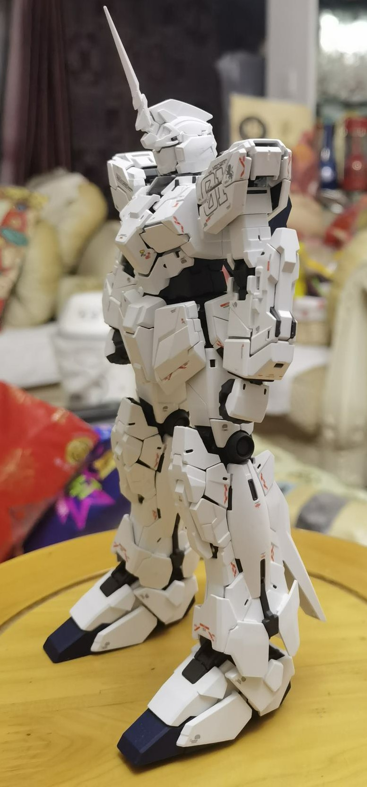

# 你可能会需要的术语介绍

众所周知，一个领域的黑话对新人来说是比较不友好的，为此我从知乎上找了一篇黑话大赏（bushi）做了点改良放在这里。如果遇到看不懂的词了可以来这找找。<strong>在系统学习之前可以先无视这篇文章，遇到问题再来找找</strong><u>。</u>

> 作者：Young 链接：[https://www.zhihu.com/question/469612040/answer/2008770105](https://www.zhihu.com/question/469612040/answer/2008770105) 来源：知乎

- feature：一个向量
- representation：还是一个向量
- embedding：把输入映射成向量，有时作为名词=feature
- 提高泛化性：在各种东西上预测更准了
- 过拟合：训练过头了
- attention：加权提取特征，越重要的 feature 权重越高
- adaptive：还是加权
- few-shot learning：看了几个样本就学会了
- zero-shot learning：一个没看就开始用自带的知识瞎蒙
- self-supervised：自学（自监督）
- semi-supervised：教一点自学一点（半监督）
- unsupervised：没人教了，跟谁学？（无监督）
- end-to-end：一套操作，行云流水搞到底（输入是图像，输出也是图像就算）
- multi-stage：发现不行，还得一步一步来
- domain：我圈起来一堆样本，就管他叫一个<u>domain</u>
- transfer：我非得在这一堆样本上训练，用在另一堆样本上，就是不直接训练，就是玩 ～
- adversarial：我加了一部分就是让 loss 增大
- robust：很稳我不会让 loss 变大的（但也不容易变小了）
- state of the art（sota）：我（吹 nb）第一
- outperform：我虽然没第一，但是我比 baseline 强
- baseline：(故意)选出来的方法，让我能够看起来比它强
- empirically：我做实验了，但不知道为啥 work
- theoretically：我以为我知道为啥 work，但没做实验，或者只做了个 toy model
- multi 开头词组
- multi-task：把几个不同任务的 loss 加一起，完事
- multi-domain：把几堆儿样本混一块训练，完事
- multi-modality：把视频语音文字图像 graph 点云 xxx 混一块训练，完事
- multi-domain multi-modal multi-media model：mua～mua～mua～mua……
- 消融实验：删掉某模块做对比实验
- 长尾数据：出现频率低的类别很多
- ... Is all you need：骗你的，就是把你骗进来。除了...你还要一堆 trick
- 体素：我把世界变成 MC 了，世界是一堆方块，他们在不同视角下有各自的颜色和透明度
- 点云：我每采样一次得到一个点，由这些点去表示我要的物体，不太直观，来张图

这是我用照片重建的独角兽<strong>稀疏</strong>点云，红色的不用管，是照相机视角（图不够多，巨糊）

先这些，后续想起来了可能会补充。
