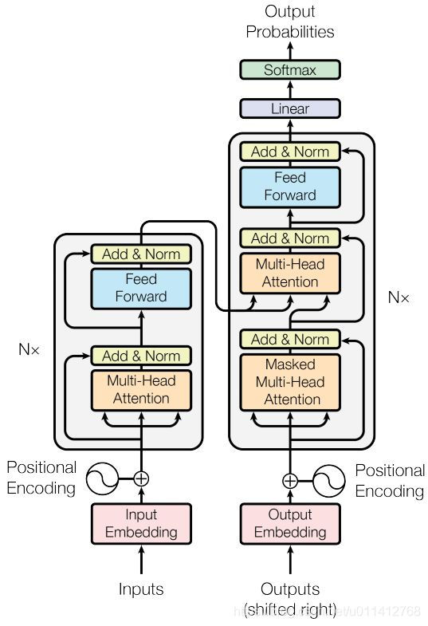

# BERT

如果你想深入了解自然语言处理相关知识，本文只能让你在基础上了解 BERT 的架构和理念，细节就不能保证了。

但如果你看 BERT 的目的是了解 BERT 的创新点以了解把 BERT 拓展到 cv 领域的工作(如 MAE)，本文可以让你快速理解 BERT 的理念。

# 前言

BERT 是一种基于 transformer 架构的自然语言处理模型，它把在 cv 领域广为应用的<strong>预训练(pre-trainning)</strong>和<strong>微调(fine-tune)</strong>的结构成功引入了 NLP 领域。

简单来说，BERT 就是一种<strong>认识几乎所有词的</strong>，<strong>训练好</strong>的网络，当你要做一些下游任务时，可以在 BERT 预训练模型的基础上进行一些微调，以进行你的任务。也就是 backbone 模型，输出的是文本特征。

举个例子，我要做一个文本情感分析任务，也就是把文本对情感进行分类，那我只需要在 BERT 的基础上加一个 mlp 作为分类头，在我的小规模数据上进行继续训练即可（也就是微调）。

mlp 的重点和创新并非它的模型结构，而是它的训练方式，前面没看懂的话可以先看看训练方式。

# 模型简单讲解

## 输入与输出

因为 BERT 是一个“backbone”模型，所以它的任务是从文本中抽取特征(feature,embedding...叫法很多，其实就是个向量）因此，它的输入是文本，输出是向量。

### 文本输入前的处理

在文本被输入模型之前，我们要对它进行一些处理：

1. <strong>词向量</strong>(wordpiece embedding)：单词本身的向量表示。每个词(或者进行时过去时后缀之类的)会被记录为一个向量。它们被储存在一个字典里，这一步其实就是在字典中查找这个词对应的向量。
2. <strong>位置向量</strong>(position embedding)：将单词的位置信息编码成特征向量。构建 position embedding 有两种方法：BERT 是初始化一个 position embedding，<strong>然后通过训练将其学出来</strong>；而 Transformer 是通过<strong>制定规则</strong>来构建一个 position embedding。
3. <strong>句子向量</strong>(segment embedding)：用于区分两个句子的向量表示。这个在问答等非对称句子中是用于区别的。(这个主要是因为可能会用到对句子的分析中)

BERT 模型的输入就是上面三者的和，如图所示：

## 模型结构

简单来说，BERT 是 transformer<strong>编码器</strong>的叠加，<strong>也就是下图左边部分</strong>。这算一个 block。

说白了就是一个 多头自注意力=>layer-norm=> 接 feed forward(其实就是 mlp)=>layer-norm，没有什么创新点在这里。因为是一个 backbone 模型，它没有具体的分类头之类的东西。输出就是最后一层 block 的输出。

# 训练方式

BERT 训练方式跟 cv 里的很多 backbone 模型一样，是先用几个具体任务训练模型，最后把分类头之类的去掉即可。

它用了以下两种具体任务进行训练：

## 随机掩码（完形填空 MLM）

跟以往的 nlp 模型不同，BERT 的掩码并非 transformer 那样，给前面不给后面，而是在句子中随机把单词替换为 mask，让模型去猜，也就是完形填空。下面给个例子：

<strong>划掉的单词是被 mask 的</strong>

正常的掩码：I am a <del>little cat</del>

BERT 的随机掩码：I <del>am</del> a little <del>cat</del>

#### 一些技术细节：

mask 方法是先抽取 15% 的单词，这些单词中 10% 不做变化，10% 替换为随机单词(让模型适应错别字用的)，剩下 80% 替换为 mask。

## 前后句判别(NSP)

这个很简单，从一篇文章中抽出两句，让模型判断它们是否是相邻的两个句子。

## 意义

BERT 的训练方式完全是无监督或者说自监督的。无论是 MLM 还是 NSP 都不需要进行人工标注，只要它是一个通顺的句子，就可以拿来进行训练，这大大降低了训练成本并且加大了数据使用量，这也是 BERT 最大的贡献点所在。

### 局限

BERT 因为是以完型填空训练的，因此不能用于文本生成任务，但是在分类等任务上效果显著并且广为适用。

# 相关资料：

李沐的【BERT 论文逐段精读【论文精读】】 [https://www.bilibili.com/video/BV1PL411M7eQ/?share_source=copy_web&vd_source=59df19b7fca15c3fb440b91c21605fc6](https://www.bilibili.com/video/BV1PL411M7eQ/?share_source=copy_web&vd_source=59df19b7fca15c3fb440b91c21605fc6)

原论文：[https://arxiv.org/pdf/1810.04805v2](https://arxiv.org/pdf/1810.04805v2)
