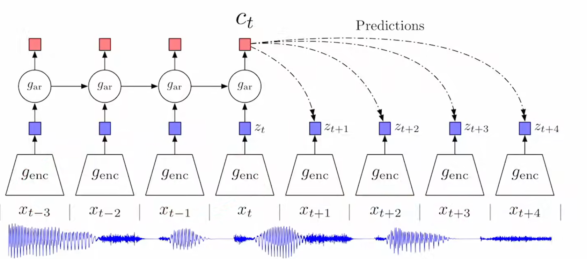
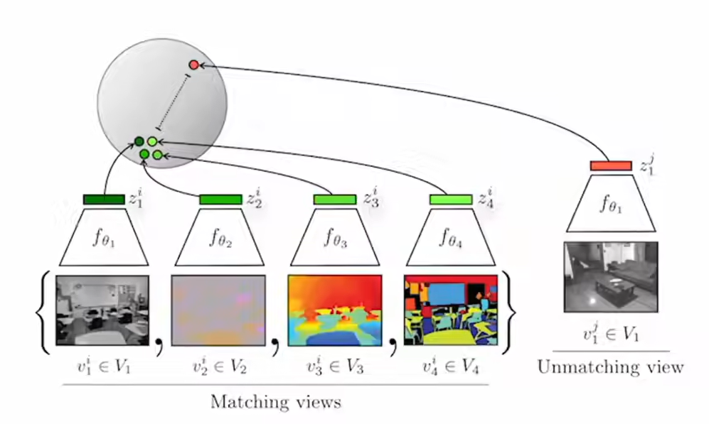

# 定义正负样本的方式

因为涉及多篇论文，就不具体一个个讲了，在这里总结一下一些定义正负样本的方式，这两种方式虽然本身并不突出，但是都对后续一些重要工作有一些铺垫作用。

# 1.时序性定义（生成式模型）

这是处理音频的一个例子，<strong>给模型 t 时刻以前的信息，让它抽取特征并对后文进行预测，真正的后文作为正样本，负样本当然是随便选取就好啦。</strong>

不同于之前说的个体判别，这个是<strong>生成式模型</strong>，这个模型不止可以处理音频，还可以处理图片（每一个块换成一个词）或者处理图片（以 patch 为单位）。

是不是有点眼熟？这跟我前面写的 BERT 和 MAE 其实异曲同工，不过这两位是随机 mask，而非时序性的 mask。

# 2.以物体不同角度或者感官作为正样本

一只狗可以被我们用不同感官所感受到，比如看见狗，听见狗叫声，摸到狗，得到文字描述等等。如果我们能统一这些模态的信息，这未尝不是一种特征提取。

这里就用了几个不同感官下的数据进行训练，不过可能是找配对的音频比较困难，作者用的是

原始图片，深度图，swav ace normal，分割图片这四个视角作为正样本，其他不相关图片作为负样本。

这种多视角的特征提取也引出了后面 CLIP 这篇论文，它做到了文本和图像特征的统一，我们后续再讲

（这篇论文我准备开个新坑放着了，因为说实话不算对比学习，算多模态）

