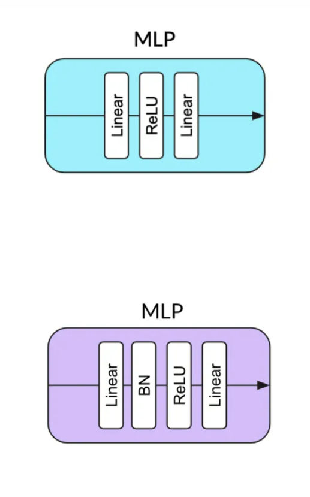

# BYOL

# 前言

这篇论文的主要特点是<strong>它的训练不需要负样本</strong>，并且能保证<strong>模型不坍塌</strong>。

当一个普通的对比学习模型没有负样本时，它的损失函数就<strong>只有正样本之间的差距</strong>，这样模型只会学到一个<strong>捷径解</strong>————你给我什么输入我都输出同一个值，这样 loss 就永远=0 了（<del>开摆</del>）

而<strong>BYOL</strong>就解决了这一问题，使得训练不再需要负样本。

# 模型结构

前半部分很普通，跟 SimCLR 是基本一致的，一个图片经过两种不同的数据增强，进入两个编码器，得到两个不同的特征。

值得一提的是，这里下面的这个粉色的编码器用的是<strong>动量编码器</strong>的更新方式。也就是说它是紫色那个编码器的动量编码器。

而提取特征之后，经过两个 `SimCLR` 中提出的额外的 mlp 层 z，在此之后，它们给紫色的那支加了一个新的模块，<strong>predictor</strong>。

<strong>predictor</strong>的模型结构就是跟 z 一样的<strong>mlp 层</strong>。它的任务是<strong>通过紫色的特征去预测粉色的特征</strong>。也就是说它的代理任务换成了<strong>生成式</strong>。

而具体的损失只有预测特征和真实特征的损失，用的是<strong>MSEloss</strong>。

下面的粉色分支最后一步是不进行梯度回传的。它的更新完全依赖紫色的那个编码器。

# 所以为什么不用负样本能左脚踩右脚螺旋升天呢？

在原文中，作者也没有说出个所以然来，不过后面有篇博客发现了问题所在。

其实这是 BN 的锅，蓝色的那个是一般的对比学习使用的，而紫色的是 BYOL 使用的。很明显发现它多了一个 BN。

### 有篇博客在复现 BYOL 时，不小心没加这个 BN 层，导致模型直接摆烂。那么 BN 到底藏着什么呢？

我们得先来回顾一下 BN 做了什么。

BN 根据批次的均值和方差进行归一化

训练时，均值、方差分别是该批次内数据相应维度的均值与方差；

推理时，均值、方差是基于所有批次的期望计算所得。

因此，博客作者认为，虽然我们只用了正样本进行训练，但是这个正样本包含了<strong>本批次所有样本的信息</strong>（均值，方差），所以<strong>实际上并不是真正的无负样本。</strong>

而这个 batch 的均值，即平均图片，可以看作 `SawAV` 里的聚类中心，是所有历史样本的聚类中心。（<del>很玄学</del>）

### 作者看到这个博客就急了

如果真是这样的话，<strong>BYOL 就还是没有逃脱出对比学习的范畴</strong>，它还是找了一个东西去做对比，其创新性就大大降低了。所以作者赶紧做实验，看看能不能找到 BYOL 模型不坍塌的另外一种解释。最终又写了一篇论文进行回应。

  这篇论文叫 BYOL works even without batch statistics，即在没有 BN 的时候 BYOL 照样能工作，详细的消融实验结果如下表所示 ：

<strong>BN 非常关键</strong>：只要是 `projector`（SimCLR 提出的 mlp）中没有 BN 的地方，SimCLR 性稍微下降；但是 BYOL 全都模型坍塌了。

<strong>有 BN 也会坍塌</strong>：作者找到了特例（红色框），即使当 `projector` 有 BN 的时候，BYOL 还是训练失败了 。如果 BN 真的很关键，它真的提供了隐式负样本的对比学习的话，训练就不应该失败

<strong>完全没有 BN，SimCLR 也坍塌</strong>（最后三列的结果。要注意 SimCLR 只有一层 projector）。这表明完全不用归一化，SimCLR 这种使用负样本进行对比学习的方式也无法训练。

  最终结论：BN 跟它原来的设计初衷一样，主要作用就是提高模型训练时的稳定性，从而不会导致模型坍塌 。作者进一步延伸，如果一开始就能让模型初始化的比较好，后面的训练即使离开了 BN 也没有问题。

作者为此又设计了一个实验，使用 `group norm`+`weight standardization` （前者也是一种归一化方式，后者是一种卷积权重标准化方式，但都没有对 batch 中的数据进行融合），BYOL 的 top-准确率可以达到 74.1%，和原来精度可以认为是一样了（74.3%）。

<strong>至今其实这个问题也没有一个很合理能服众的解释。</strong>

# 总结

主要的贡献在于无需负样本的学习。但是没有合理的解释。
