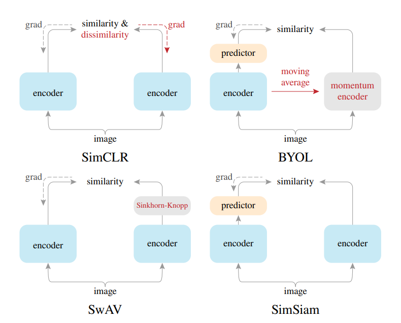

# SimSiam

# 前言

## 提出背景

BYOL 之后，大家都发现对比学习是靠许许多多的小 trick 和技术堆叠起来的，每个技术都有贡献，但是不算很多，前沿的网络往往采用了众多的技术得到很好的效果。

这时候，作者团队希望能够化繁为简，探索一下哪些真正有用，哪些贡献不大。

## 于是就有了 SimSiam

是对前面几乎所有工作的总结，它提出了一个非常简单的网络，但是达到了很高的性能，并在其上追加了前面工作的一些细节，来展示每个小技术的真正贡献如何。

它不需要动量编码器，不需要负样本，不需要 memory bank，就是非常简单。

# 模型结构

模型的结构是一个 `“孪生网络”`，其实于 BYOL 的结构很像，不过没有用动量编码器，左右两个编码器都是一样的，因此叫 `孪生网络`。

虽然看起来只有左边预测右边，其实右边也有一个 predictor 去预测左边的特征，两边是对称的，左右的优化有先后顺序。


结构其实没什么特殊的地方，主要讲讲思想。

# SimSiam 主要回答的是两个问题

# 1.为什么不用负样本模型不会坍塌？

原论文中提出的解释并不是最完美的。而且这个问题的解释涉及了动力学等知识，我也没有足够的知识储备去讲解这个问题，这里只能讲一些与解答相关的信息，如果有兴趣可以看下面链接中的解释：

这里要涉及到一个机器学习的经典算法，<strong>EM 算法</strong>，它也是<strong>k-means</strong>的核心思想之一。

因为本文的主旨原因，我不会在这里细讲这个算法，但是大家了解这是个什么东西即可。

<strong>EM 算法</strong>用于优化带有未知参数的模型，`k-means` 的聚类中心就可以看作一个未知参数，我们要同时优化模型本体和聚类中心。所以我们先对其中一个目标 A 做<strong>随机初始化</strong>，然后<strong>先优化</strong>另一个目标 B，再反过来用另一个目标 B 优化后<strong>的结果优化被随机初始化的目标 A</strong>，这就是一次迭代，只要不断循环这个迭代，EM 算法往往能找到最优解。

这里可以把<strong>经过 predictor 预测头的特征</strong>作为 `k-means` 里的特征，而另一个作为<strong>目标的特征</strong>作为<strong>聚类中心</strong>，经过预测头的特征直接反向传播进行优化，作为目标的特征则是通过上面说的对称的操作经过预测头进行优化。

最最直白地解读结论的话，可以说是，这种先后优化的 EM 算法，使得模型“来不及“去把权重全部更新为 0。（模型坍塌）具体的推导需要动力学的知识，这里不做展开。

# 2.对前人工作的总结

这是作者总结的所有”孪生网络“的模型结构，很精炼。



下面是这些网络训练结果的对比，也列出了它们分别有哪些 trick（用的是分类任务）

```
                                                   负样本         动量编码器      训练轮数 
```


具体结果还是图片比较直观（


